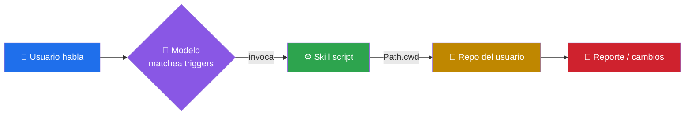
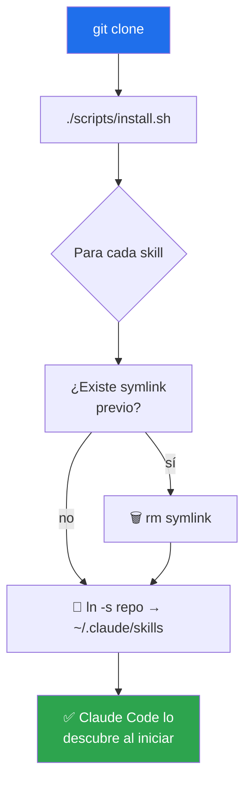

<div align="center">

# 🧰 claude-skills-toolkit

### ⚡ Skills agentic listos para producción para [Claude Code](https://claude.com/claude-code) y runtimes compatibles

Automatización de tareas repetitivas de desarrollo — 🔒 auditoría de seguridad multi-fuente, 📋 lint de YAML, 📝 lint de Markdown, 🐍 lint de Python con paridad local↔CI, 📌 cobertura real de pinning de dependencias, 🐳 limpieza de Docker, 🩺 diagnóstico de `compose.yml`, 🪝 guardián pre-commit, 🛡️ guardián pre-push, 📸 screenshots web, 🐍 coherencia de versión de Python, 🧭 auditoría de coherencia docs↔repo, 🏷️ control de versión de release y 📄 renderizado de Markdown a documento.
**Sin dependencias innecesarias** — la mayoría usa solo Python stdlib.

[](LICENSE)
[](https://github.com/vladimiracunadev-create/claude-skills-toolkit/releases)
[](https://www.python.org/)
[](#-catálogo)
[](#-instalación)
[](https://github.com/vladimiracunadev-create/claude-skills-toolkit/actions/workflows/ci.yml)
[](tests/)
[](docs/supply-chain-security.md)
[](CONTRIBUTING.md)
[](https://github.com/vladimiracunadev-create)

[**📦 Instalación**](#-instalación) · [**🗂️ Catálogo**](#-catálogo) · [**🚀 Uso**](#-uso) · [**🧭 Diseño**](#-diseño) · [**📚 Documentación**](#-documentación) · [**🤝 Contribuir**](CONTRIBUTING.md)

</div>

---

## 💡 ¿Qué es un "skill"?

Un **skill** es una carpeta autocontenida que el agente carga al iniciar la sesión:

```text
skills/<nombre>/
├── SKILL.md          # Contrato · frontmatter YAML + descripción + triggers
├── <script>.py|.sh   # Lógica ejecutable
└── README.md         # (opcional) demo extendido
```

El agente lee el `description` del frontmatter para decidir **cuándo** invocarlo automáticamente. El script vive en `~/.claude/skills/<nombre>/` (instalado vía symlink) y se ejecuta sobre `Path.cwd()` — el repo donde estás trabajando ahora.



> [!IMPORTANT]
> **Skill ≠ agente.** Un **skill** es *conocimiento empaquetado* (instrucciones + scripts) que el modelo **carga en su propio contexto** y ejecuta él mismo — como una receta con su caja de herramientas. Un **agente** (o subagente) es *una instancia de Claude que corre por separado*, con su propio contexto y herramientas, a la que se **delega** una tarea — como un ayudante al que le encargas un plato completo. Un agente puede *usar* skills; un skill puede *pedir* que se lancen agentes. **Este repo colecciona skills, no agentes** — ver [Qué es y qué no es este repo](#-qué-es-y-qué-no-es-este-repo).

---

## 🗂️ Catálogo

<table>
<thead>
<tr>
<th width="22%">Skill</th>
<th width="48%">Qué hace</th>
<th width="20%">Triggers</th>
<th width="10%">Deps</th>
</tr>
</thead>
<tbody>
<tr>
<td>

### 🔒 [security-audit](skills/security-audit/README.md)

<sub>1788 LOC · Python · </sub>

</td>
<td>

Auditoría en **12 capas**: OSV.dev · CISA KEV · EPSS · Bandit SAST · trivy/grype · gitleaks · zizmor · hadolint · typosquat heurístico.
Genera reporte Markdown con **Plan de Remediación transversal** y **cobertura real del scan** (deps sin pin exacto o sin lockfile quedan listadas explícitamente como fuera del scan — nunca infla la cobertura). Modo `--apply --verify` aplica bumps y los revierte si los tests fallan.

</td>
<td>

🔎 `audita seguridad`<br>
🛡️ `scan CVE`<br>
🚨 `vulnerability scan`

</td>
<td>

stdlib<br>
<sub>(opt-in: bandit, trivy, gitleaks, zizmor, hadolint)</sub>

</td>
</tr>
<tr>
<td>

### 📋 [yaml-control](skills/yaml-control/README.md)

<sub>271 LOC · Python · </sub>

</td>
<td>

Validación YAML en 3 capas: sintaxis + `actionlint` para workflows + convenciones del repo (actions pinneadas a SHA, permisos explícitos, `fail-fast: false` en matrices).

</td>
<td>

✅ `valida los yaml`<br>
🔧 `lint yaml`<br>
⚙️ `actionlint`

</td>
<td>

`pyyaml`<br>
<sub>(opt-in: actionlint)</sub>

</td>
</tr>
<tr>
<td>

### 📝 [md-lint-fix](skills/md-lint-fix/README.md)

<sub>400 LOC · Python · </sub>

</td>
<td>

Detecta y auto-corrige `markdownlint-cli2`: MD024 con contexto del padre, MD040 infiriendo idioma, MD031/32/34/28/27/22 vía `--fix`. Trabaja sobre `.md` modificados según `git`.

</td>
<td>

✨ `arregla el lint MD`<br>
📄 `corrige los markdown`

</td>
<td>

`markdownlint-cli2`<br>
<sub>(pnpm)</sub>

</td>
</tr>
<tr>
<td>

### 🐳 [docker-cleanup](skills/docker-cleanup/README.md)

<sub>67 LOC · Bash · </sub>

</td>
<td>

Wipe completo de Docker: containers + images + volumes + custom networks + build cache. Idempotente. Reporta espacio liberado con `docker system df` antes/después.

</td>
<td>

🧹 `limpia docker`<br>
💥 `wipe docker`<br>
♻️ `reset docker`

</td>
<td>

`docker` CLI

</td>
</tr>
<tr>
<td>

### 🩺 [docker-compose-doctor](skills/docker-compose-doctor/README.md)

<sub>400 LOC · Python · </sub>

</td>
<td>

Análisis estático de `compose.yml`: puertos host duplicados, healthchecks faltantes, `depends_on` sin `condition: service_healthy`, imágenes con `:latest`, volúmenes huérfanos, `env_file` inexistentes. Detecta lo que el schema oficial no captura.

</td>
<td>

🩺 `revisa el compose`<br>
🧰 `docker compose lint`<br>
🚦 `por qué no levanta`

</td>
<td>

`pyyaml`

</td>
</tr>
<tr>
<td>

### 🪝 [pre-commit-guard](skills/pre-commit-guard/README.md)

<sub>312 LOC · Python · </sub>

</td>
<td>

Gemelo rápido de `pre-push-guard` pero sobre lo **staged**: corre `yaml-control` + `md-lint-fix --dry-run` + `python-lint-guard --parity-only` sobre `git diff --cached` antes de cada commit. Bloquea que un YAML roto, un Markdown malformado o un gate de lint inexistente entren al historial local. No corre pytest ni ruff — mantiene el commit < 2s.

</td>
<td>

🪝 `pre-commit`<br>
✅ `valida antes de commitear`<br>
🚦 `guard antes de commit`

</td>
<td>

stdlib

</td>
</tr>
<tr>
<td>

### 🛡️ [pre-push-guard](skills/pre-push-guard/README.md)

<sub>345 LOC · Python · </sub>

</td>
<td>

Orquestador pre-push: corre `yaml-control` + `md-lint-fix --dry-run` + `python-lint-guard` + `pytest` sobre el diff vs `origin/<branch>`. Fail-fast con reporte unificado. Opt-in como git hook con `--install-hook`.

</td>
<td>

🛡️ `valida antes de pushear`<br>
✅ `corre todos los checks`<br>
🪝 `pre-push hook`

</td>
<td>

stdlib<br>
<sub>(opt-in: pytest)</sub>

</td>
</tr>
<tr>
<td>

### 📸 [web-snap](skills/web-snap/README.md)

<sub>213 LOC · Python ·  · </sub>

</td>
<td>

Screenshots de URLs web en **Windows** usando Chrome/Edge ya instalado. Sin Selenium ni Playwright. Trae al frente la ventana vía `user32.SetWindowPos(HWND_TOPMOST)` antes de capturar. Modo single o batch desde JSON.

</td>
<td>

📸 `captura pantalla`<br>
🌐 `screenshot de esta URL`<br>
📋 `evidencia visual de despliegue`

</td>
<td>

`pillow`

</td>
</tr>
<tr>
<td>

### 🐍 [python-version-control](skills/python-version-control/README.md)

<sub>449 LOC · Python · </sub>

</td>
<td>

Audita la coherencia de versión de Python entre 12+ fuentes de verdad: `pyproject.toml` (`requires-python`, classifiers, `target-version` de ruff/mypy/black), `Dockerfile FROM`, `.github/workflows/*.yml` (`setup-python`), `.python-version`, `runtime.txt`, `tox.ini`, `noxfile.py`, `pre-commit`. Detecta drift y propone versión canónica. `--fix` es opt-in con confirmación.

</td>
<td>

🐍 `audita versión python`<br>
🔀 `drift python`<br>
📌 `python version control`

</td>
<td>

stdlib<br>
<sub>(opt-in: `tomli` para Python < 3.11)</sub>

</td>
</tr>
<tr>
<td>

### 🧭 [repo-coherence-audit](skills/repo-coherence-audit/README.md)

<sub>389 LOC · Python · </sub>

</td>
<td>

Reconcilia lo que los **docs afirman** contra las **fuentes de verdad** del repo: versión (todos los manifests), conteo de tests (`pytest --collect-only`), workflows (lista + conteo), pins de acciones a SHA, prerequisitos, **encoding/mojibake** (`mojibake_probe.py`, round-trip sloppy-cp1252) y **metadatos del remoto** (el "About" de GitHub vía `gh api`). Distingue el marcador de estado **ACTUAL** (se sincroniza) de la referencia **HISTÓRICA** (se conserva). Modo `report` por defecto; `fix` acotado opt-in.

</td>
<td>

🧭 `audita coherencia`<br>
🔀 `drift de docs`<br>
📊 `los conteos no cuadran`<br>
🔤 `encoding roto`

</td>
<td>

stdlib<br>
<sub>(opt-in: pytest para el conteo)</sub>

</td>
</tr>
<tr>
<td>

### 🐍 [python-lint-guard](skills/python-lint-guard/README.md)

<sub>483 LOC · Python · </sub>

</td>
<td>

El gate de lint Python que faltaba antes de commit/push — y **no es un wrapper de ruff**. Cruza lo que el repo **declara** (`pyproject`, `ruff.toml`, `setup.cfg`, `.flake8`, `tox.ini`, `.pre-commit-config.yaml`) contra lo que el CI **ejecuta**, y detecta el caso que más commits de arreglo produce: el gate declarado **cuyo hook local nunca se instaló**. Con `ruff` disponible separa las violaciones mecánicas (`--fix`) de las que exigen criterio (`F841`, `E402`, `S110` — nunca se auto-corrigen).

</td>
<td>

🐍 `arregla el lint de Python`<br>
🔧 `corrige ruff`<br>
❓ `por qué falla el lint en CI`

</td>
<td>

stdlib<br>
<sub>(opt-in: ruff)</sub>

</td>
</tr>
<tr>
<td>

### 📌 [python-deps-pinning](skills/python-deps-pinning/README.md)

<sub>374 LOC · Python · </sub>

</td>
<td>

Mide qué parte del árbol de dependencias es **realmente auditable** por un scanner de CVEs y **nombra las que quedan fuera**. Una dep declarada como `requests>=2.0` sin lockfile no resuelve a una versión, así que ningún scanner puede pronunciarse: un "0 vulnerabilidades" sobre esa superficie es un falso tranquilizante. Amplía la cobertura de `security-audit` en vez de competir con él.

</td>
<td>

📌 `pinea las dependencias`<br>
🔒 `genera el lockfile`<br>
❓ `por qué el scan no ve nada`

</td>
<td>

stdlib

</td>
</tr>
<tr>
<td>

### 🏷️ [version-bump](skills/version-bump/README.md)

<sub>397 LOC · Python · </sub>

</td>
<td>

Cambio de versión coherente en **todo** el repo, para cualquier stack (Cargo, npm, Python, Go, .NET, Java o sin gestor). `version_probe.py` vuelve determinista la regla crítica: clasifica cada aparición en **ACTUAL** (se bumpea), **HISTÓRICO** (se conserva) o **AMBIGUO** (revisión humana — no adivina). `--verify` es la prueba de fuego: exit 1 si algún badge quedó anclado a la versión vieja.

</td>
<td>

🏷️ `sube la versión`<br>
🚀 `prepara el release`<br>
🔀 `incoherencias de versión`

</td>
<td>

stdlib<br>
<sub>(opt-in: gh para release)</sub>

</td>
</tr>
<tr>
<td>

### 📄 [md-to-doc](skills/md-to-doc/README.md)

<sub>582 LOC · Python · </sub>

</td>
<td>

Renderiza cualquier árbol de Markdown (`docs/`, ADRs, runbooks) a **un** HTML autocontenido —imágenes embebidas como data URI— y opcionalmente a PDF. Núcleo 100% stdlib; capas opt-in que degradan con aviso: `images` (Pillow), `highlight` (pygments), `diagrams` (mmdc: los mermaid que GitHub renderiza pero un PDF no, cacheados por hash), `exec` (captura la salida **real** del código), `pdf`.

</td>
<td>

📄 `genera un PDF de la doc`<br>
🖼️ `los diagramas no salen`<br>
📦 `documentación offline`

</td>
<td>

stdlib<br>
<sub>(opt-in: pillow, pygments, mmdc, xhtml2pdf)</sub>

</td>
</tr>
</tbody>
</table>

---

## 📦 Instalación

> **Prerequisitos:** 🐍 Python 3.11+ · 🌿 Git · 🤖 (opcional) [Claude Code](https://claude.com/claude-code).

### ⚡ Instalación en una máquina nueva (one-liner)

**🐧 Linux · 🍎 macOS · Git Bash:**

```bash
git clone https://github.com/vladimiracunadev-create/claude-skills-toolkit.git ~/claude-skills-toolkit \
  && cd ~/claude-skills-toolkit \
  && ./scripts/install.sh
```

**🪟 Windows · PowerShell:**

```powershell
git clone https://github.com/vladimiracunadev-create/claude-skills-toolkit.git $env:USERPROFILE\claude-skills-toolkit; `
  cd $env:USERPROFILE\claude-skills-toolkit; `
  .\scripts\install.ps1
```

> 💡 **Windows.** Para que los symlinks funcionen activa **Developer Mode** (*Settings → Privacy & security → For developers*) o ejecuta PowerShell como administrador. Si no, `install.ps1` cae a copia automáticamente.

### 🔄 Actualizar en cualquier equipo

```bash
cd ~/claude-skills-toolkit && git pull
```

Como la instalación usa symlinks, `git pull` propaga los cambios en caliente — sin reinstalar.

### 🔍 Qué hace el instalador



Es idempotente. Ventajas frente a copiar:

- 🚀 `git pull` basta para actualizar todos los equipos.
- 🔥 Editar un skill en el repo aplica en caliente.
- 🧹 Desinstalar = borrar el symlink (el repo queda intacto).

Detalles completos —incluyendo troubleshooting, instalación paso a paso y sincronización de varios equipos— en [INSTALL.md](INSTALL.md).

---

## 🚀 Uso

Una vez instalados, los skills se invocan **conversacionalmente** desde Claude Code:

```text
> audita la seguridad de este repo
  → 🔒 invoca security-audit · genera SECURITY_AUDIT_<fecha>.md

> valida los workflows antes de pushear
  → 📋 invoca yaml-control · revisa .github/workflows/*.yml

> arregla los markdown modificados
  → 📝 invoca md-lint-fix · corrige .md según git status

> limpia docker
  → 🐳 invoca docker-cleanup · libera espacio
```

También como scripts directos:

```bash
python ~/.claude/skills/security-audit/security_audit.py --layers all --min-severity high
python ~/.claude/skills/yaml-control/yaml_control.py --workflows
bash   ~/.claude/skills/docker-cleanup/scripts/wipe.sh
```

---

## 🧭 Diseño

### 🎯 Principios

| | |
|---|---|
| 🪶 **Zero-deps por defecto** | Funcionan con Python stdlib. Las capas avanzadas son opt-in y degradan silenciosamente si la herramienta no está disponible. |
| 📁 **`Path.cwd()`-centric** | No importa desde qué carpeta se invoquen — operan sobre el repo actual. |
| 🔍 **Honestidad sobre límites** | Cada `SKILL.md` documenta qué hace, qué **no** hace, y los riesgos (ej. `--apply` sin `--verify` puede romper el build). |
| 🌐 **Cross-platform** | Linux, macOS, Windows (Git Bash / MINGW / PowerShell). Solo `docker-cleanup` requiere bash. |
| 🐕 **Eat your own dog food** | El propio repo se valida con `yaml-control` + `md-lint-fix` en [CI](.github/workflows/ci.yml). |
| 🛡️ **Supply chain hardened** | Cualquier dependencia Node usa `pnpm v11` (postinstall bloqueado + cuarentena de 24 h por defecto). Actions pinneadas a SHA. Ver [docs/supply-chain-security.md](docs/supply-chain-security.md). |

### 🧬 Anatomía de un skill

```text
skills/<nombre>/
├── SKILL.md          ← obligatorio · frontmatter + triggers (contrato con el agente)
├── README.md         ← obligatorio · docs para humanos con diagramas + casos de uso
└── <script>.py|.sh   ← lógica ejecutable
```

**Dos archivos, dos audiencias.** `SKILL.md` es el contrato que el agente lee para decidir cuándo invocar el skill — descripción densa optimizada para matching semántico. `README.md` es la documentación para humanos que llegan al skill vía GitHub, con diagramas Mermaid, casos de uso reales y referencias externas. Cada skill del toolkit tiene ambos.

El frontmatter mínimo:

```yaml
---
name: nombre-del-skill
description: Qué hace + cuándo invocarlo (triggers en español e inglés).
             El agente lee este campo para decidir si activarlo.
---
```

---

## 🆕 Crear un skill nuevo

```bash
cp -r skills/_template skills/mi-skill
# Editar skills/mi-skill/SKILL.md y main.py
./scripts/install.sh
```

Ver [CONTRIBUTING.md](CONTRIBUTING.md) para las reglas completas.

---

## 📚 Documentación

| Documento | Para qué |
|---|---|
| 📘 [README.md](README.md) | Entry point · catálogo + quick start *(estás aquí)* |
| 📦 [INSTALL.md](INSTALL.md) | Instalación, actualización y sincronización entre equipos |
| 🤝 [CONTRIBUTING.md](CONTRIBUTING.md) | Cómo añadir un skill nuevo + estilo de código |
| 📋 [CHANGELOG.md](CHANGELOG.md) | Historial de versiones (Keep a Changelog + SemVer) |
| 🗺️ [ROADMAP.md](ROADMAP.md) | Próximos hitos y no-objetivos explícitos |
| 🔐 [SECURITY.md](SECURITY.md) | Política de seguridad y cómo reportar vulnerabilidades |
| 🛡️ [docs/supply-chain-security.md](docs/supply-chain-security.md) | Política frente a ataques Shai-Hulud · por qué `pnpm` en vez de `npm` |
| 🆘 [SUPPORT.md](SUPPORT.md) | Canales por tipo de problema · cómo pedir ayuda |
| 🤗 [CODE_OF_CONDUCT.md](CODE_OF_CONDUCT.md) | Código de conducta de la comunidad |
| 🏗️ [docs/architecture.md](docs/architecture.md) | Arquitectura interna · decisiones de diseño |
| 🚀 [docs/skill-promotion.md](docs/skill-promotion.md) | Flujo formal para promover skills locales al toolkit |
| 💼 [RECRUITER.md](RECRUITER.md) | Para reclutadores · qué demuestra este proyecto |

---

## 🗺️ Roadmap

Resumen — versión completa en [ROADMAP.md](ROADMAP.md).

**v0.2.0 · ✅ publicada 2026-07-01** — 🐍 `python-version-control` + workflow de release automatizado.

**v0.3.0 · en curso:**

- [x] 🪝 `pre-commit-guard` — gemelo rápido de `pre-push-guard` sobre lo staged *(primer hito v0.3.0)*
- [x] 🧭 `repo-coherence-audit` — reconcilia afirmaciones de los docs (versión, conteos, workflows, pins) contra la verdad del repo
- [x] 🐍 `python-lint-guard` — paridad de toolchain local↔CI + separación mecánico/criterio; cierra el hueco de Python en ambos guards
- [x] 📌 `python-deps-pinning` — cobertura real del scan de dependencias; amplía lo que `security-audit` puede auditar
- [x] 🏷️ `version-bump` — control de versión general con `version_probe.py` (ACTUAL vs HISTÓRICO determinista)
- [x] 📄 `md-to-doc` — Markdown → HTML autocontenido/PDF por capas opt-in
- [ ] 🧹 `dependency-cleanup` — detecta dependencias sin uso en `requirements.txt` / `package.json`
- [ ] ✍️ `commit-message-improve` — reescribe commits siguiendo conventional commits
- [ ] 🗃️ `sql-migration-safety` — analiza migraciones DB (lock holding, FK cascades)
- [ ] ⚛️ `react-component-scaffold` — genera componente React + tests + stories
- [ ] 🧪 Tests por skill (happy path por cada uno) *(progreso: 5/14)*
- [ ] 🔌 Integración explícita con [Cursor](https://www.cursor.com/) y [Windsurf](https://codeium.com/windsurf)

¿Sugerencias? 💬 Abre un [issue](https://github.com/vladimiracunadev-create/claude-skills-toolkit/issues).

---

## 🤝 Contribuir

PRs bienvenidos. Antes de abrir uno, revisa [CONTRIBUTING.md](CONTRIBUTING.md). Reglas mínimas:

1. 🎒 Cada skill debe ser **autónomo** (sin paths absolutos al sistema del autor).
2. 📜 `SKILL.md` con frontmatter completo (`name` + `description` con triggers).
3. 🪶 Cero dependencias por defecto. Si requiere binarios externos: documentarlo y degradar gracefully.
4. 🧪 Tests en `tests/` si la lógica es no-trivial.

---

## 🎯 Qué es y qué no es este repo

<table>
<tr>
<td valign="top" width="50%">

### ✅ Lo que este repo sí es

- 🧰 una colección de **skills** universales de tooling de desarrollo (seguridad, YAML, Markdown, Python, dependencias, Docker, versiones, coherencia docs↔repo, documentación);
- 🐍 lógica **ejecutable y probada** — la mayoría en Python stdlib, con tests en `tests/`;
- 🌐 skills **agnósticos del repo**: corren sobre `Path.cwd()`, funcionan en cualquier proyecto;
- 📜 un contrato claro por skill (`SKILL.md` + `README.md`), instalable vía symlink en `~/.claude/skills/`;
- 🪶 **cero dependencias por defecto**: los binarios externos son opt-in y degradan gracefully.

</td>
<td valign="top" width="50%">

### ❌ Lo que este repo no es

- 🚫 un repo de **agentes / subagentes**: un skill no es una instancia de Claude que actúe sola (ver el aviso [Skill ≠ agente](#-qué-es-un-skill) arriba);
- 🚫 una colección de skills **de dominio** (scraping de un sitio concreto, automatización de un proyecto puntual, flujos atados a un cliente): esos viven fuera del toolkit. El criterio no es el *formato de salida* sino la *universalidad*: `md-to-doc` renderiza el Markdown de cualquier repo y por eso entra; un generador de PDFs atado a la estructura de un curso concreto, no;
- 🚫 un plugin de distribución con `agents/` empaquetados — aquí solo hay `skills/`;
- 🚫 un framework ni un runtime: no reemplaza a Claude Code, lo **extiende**;
- 🚫 un cajón de scripts sueltos: cada skill tiene contrato, docs humanas y límites explícitos.

</td>
</tr>
</table>

## 💡 Idea fuerza

> El valor de este toolkit no está en acumular scripts, sino en **empaquetar conocimiento reutilizable con un contrato claro**: skills universales, probados y honestos sobre sus límites, que el modelo carga en el momento justo y ejecuta sobre el repo en el que estás trabajando. Skills, no agentes; universales, no de dominio.

---

## 📄 Licencia

Código y documentación original bajo [MIT](LICENSE) © 2026 [Vladimir Acuña](https://github.com/vladimiracunadev-create).

Los **binarios externos** que los skills invocan de forma opt-in (`ruff`, `bandit`, `trivy`, `grype`, `gitleaks`, `zizmor`, `hadolint`, `actionlint`, `markdownlint-cli2`, `mmdc`, `pytest`, `docker`), las **librerías Python** de las capas opcionales (`pyyaml`, `pillow`, `pygments`, `xhtml2pdf`) y las **fuentes de datos de vulnerabilidades** que se consultan en línea (OSV.dev, NVD, GHSA, PyPA, RustSec, CISA KEV, EPSS) conservan sus propias licencias y términos de uso. Este repo no los redistribuye: los detecta si están presentes y degrada limpiamente si no.

<sub>Hecho para quien quiere que el agente **ejecute** el checklist, no que lo recite.</sub>

<div align="center">

[⬆️ Empezar por la instalación](#-instalación) · [🗂️ Catálogo](#-catálogo) · [🧬 Anatomía de un skill](#-anatomía-de-un-skill) · [📚 Documentación](#-documentación) · [📋 Changelog](CHANGELOG.md) · [🗺️ Roadmap](ROADMAP.md)

---

### 🌟 Otros proyectos del autor

[🤖 langgraph-realworld](https://github.com/vladimiracunadev-create/langgraph-realworld) ·
[🗄️ gabysql](https://github.com/vladimiracunadev-create/gabysql) ·
[🧪 problem-driven-systems-lab](https://github.com/vladimiracunadev-create/problem-driven-systems-lab) ·
[📚 python-data-science-program](https://github.com/vladimiracunadev-create/python-data-science-program) ·
[🐳 docker-labs](https://github.com/vladimiracunadev-create/docker-labs)

---

¿Te ahorró un commit de arreglo? ⭐ Dale una estrella al repo.

[](https://github.com/vladimiracunadev-create/claude-skills-toolkit/stargazers)
[](https://github.com/vladimiracunadev-create/claude-skills-toolkit/network/members)
[](https://github.com/vladimiracunadev-create)

<sub>Hecho con 🧰 y ☕ por <a href="https://github.com/vladimiracunadev-create">Vladimir Acuña</a> — y demasiados PRs revisados a la 1 a.m.</sub>

</div>
