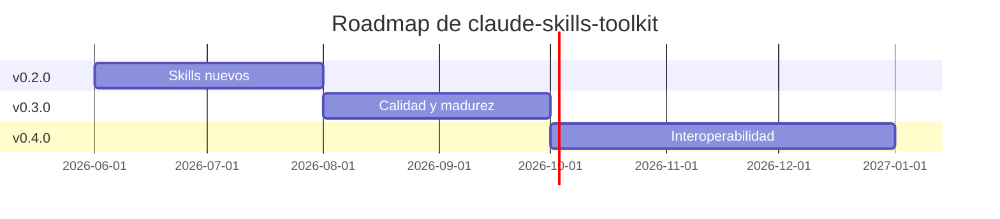

# 🗺️ Roadmap

> Dirección de `claude-skills-toolkit`. No es un compromiso de fechas — es un orden de prioridades.

---

## 📍 Estado actual — v0.1.0

- 4 skills de producción operativos: [`security-audit`](skills/security-audit/), [`yaml-control`](skills/yaml-control/), [`md-lint-fix`](skills/md-lint-fix/), [`docker-cleanup`](skills/docker-cleanup/).
- Instalación cross-platform (Linux · macOS · Windows) vía symlinks idempotentes.
- CI propio que valida YAML/Markdown del repo + suite de smoke tests cross-platform.
- Cobertura documental completa: README, INSTALL, CONTRIBUTING, CHANGELOG, ROADMAP, SECURITY, SUPPORT.

---

---

## 🎯 Próximos hitos

### 🚀 v0.2.0 — Más skills útiles

- [ ] **`react-component-scaffold`** — genera componente React + tests + stories desde una descripción.
- [ ] **`sql-migration-safety`** — analiza migraciones de base de datos antes de aplicar (lock holding, FK cascades, full table scans).
- [ ] **`dependency-cleanup`** — detecta dependencias sin uso en `requirements.txt` / `package.json` / `Cargo.toml`.
- [ ] **`commit-message-improve`** — reescribe commit messages siguiendo conventional commits.

### 🏆 v0.3.0 — Calidad y madurez

- [ ] Tests por skill (no solo estructura) — al menos un happy path por cada uno.
- [ ] Versionado SemVer + tags de release publicados en GitHub.
- [ ] Workflow `release.yml` que publique zips de cada skill como release artifact.
- [ ] `pre-commit` hook configurable que invoque `yaml-control` + `md-lint-fix` localmente.

### 🔌 v0.4.0 — Interoperabilidad

- [ ] Integración explícita con [Cursor](https://www.cursor.com/) (formato de `.cursorrules` / `.cursor/rules/`).
- [ ] Integración con [Windsurf](https://codeium.com/windsurf).
- [ ] Empaquetado como [Claude Plugin](https://docs.claude.com/en/docs/claude-code/plugins) para distribución one-click.

### 📦 Backlog · sin orden estricto

- [ ] **`db-migration-runner`** — wrapper sobre Alembic/Prisma/Flyway con rollback automático en CI.
- [ ] **`license-audit`** — verifica que todas las dependencias tienen licencias compatibles con la del proyecto.
- [ ] **`api-spec-diff`** — diff visual entre dos versiones de OpenAPI/swagger.
- [ ] **`screenshot-diff`** — comparación pixel-a-pixel para frontends con Playwright.
- [ ] **`bundle-size-watch`** — alerta en PR si el bundle (webpack/vite) crece > N%.

---

---

## 🚫 No-objetivos (explícito)

Cosas que **no** vamos a hacer:

- **Skills específicos de un cliente o proyecto privado.** Cada skill debe ser útil para cualquier developer en el mundo.
- **Wrappers triviales** de una herramienta sin valor añadido (un skill que solo hace `ls` no aporta nada).
- **Frameworks pesados con configuración compleja.** La promesa es "clonar + instalar = funciona".
- **Skills con credenciales o secrets embebidos.** Si necesitan auth, debe ser vía env var documentada.

---

---

## 💬 Cómo influir en el roadmap

- **Abrir issue** con la etiqueta `proposal:skill` describiendo el caso de uso real.
- **Abrir PR** implementando un skill del backlog (ver [CONTRIBUTING.md](CONTRIBUTING.md)).
- **Comentar en issues existentes** con tu caso de uso — ayuda a priorizar.
