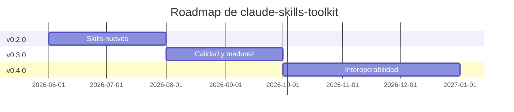

# 🗺️ Roadmap

> Dirección de `claude-skills-toolkit`. No es un compromiso de fechas — es un orden de prioridades.

---

## 📍 Estado actual

> Último release publicado: **v0.2.0**. Lo que sigue está en `main` sin taggear todavía — ver [CHANGELOG · Unreleased](CHANGELOG.md).

- **14 skills de producción operativos**: [`security-audit`](skills/security-audit/), [`yaml-control`](skills/yaml-control/), [`md-lint-fix`](skills/md-lint-fix/), [`docker-cleanup`](skills/docker-cleanup/), [`docker-compose-doctor`](skills/docker-compose-doctor/), [`pre-commit-guard`](skills/pre-commit-guard/), [`pre-push-guard`](skills/pre-push-guard/), [`web-snap`](skills/web-snap/), [`python-version-control`](skills/python-version-control/), [`repo-coherence-audit`](skills/repo-coherence-audit/), [`python-lint-guard`](skills/python-lint-guard/), [`python-deps-pinning`](skills/python-deps-pinning/), [`version-bump`](skills/version-bump/), [`md-to-doc`](skills/md-to-doc/).
- Instalación cross-platform (Linux · macOS · Windows) vía symlinks idempotentes.
- CI propio que valida YAML/Markdown del repo + **48 tests** cross-platform.
- **Workflow de release automatizado**: cada tag `v*` publica zip por skill + bundle completo.
- Cobertura documental completa: README, INSTALL, CONTRIBUTING, CHANGELOG, ROADMAP, SECURITY, SUPPORT.

---

---

## 🎯 Próximos hitos

### 🎉 v0.2.0 — Más skills útiles *(completado 2026-07-01)*

- [x] **`python-version-control`** — audita la coherencia de versión de Python entre 12+ fuentes de verdad (`pyproject.toml`, `Dockerfile`, workflows con `setup-python`, `.python-version`, `runtime.txt`, `tox.ini`, `noxfile.py`, `pre-commit`). Detecta drift y propone versión canónica. `--fix` opt-in con confirmación.
- [x] **Versionado SemVer + tags de release publicados en GitHub** *(adelantado desde v0.3.0)*.
- [x] **Workflow `release.yml`** que empaqueta cada skill como zip y publica el GitHub Release automáticamente al pushear un tag `v*` *(adelantado desde v0.3.0)*.
- [ ] **`react-component-scaffold`** — pasa a v0.3.0.
- [ ] **`sql-migration-safety`** — pasa a v0.3.0.
- [ ] **`dependency-cleanup`** — pasa a v0.3.0.
- [ ] **`commit-message-improve`** — pasa a v0.3.0.

### 🏆 v0.3.0 — Calidad, madurez y más skills *(en curso)*

- [x] **`pre-commit-guard`** — gemelo rápido de `pre-push-guard` sobre archivos staged (`yaml-control` + `md-lint-fix --dry-run`, sin pytest). Se instala como git hook con `--install-hook`. Cierra el item "pre-commit hook configurable" y lo entrega como un skill de primera clase, coherente con el patrón de `pre-push-guard`.
- [x] **`repo-coherence-audit`** — reconcilia lo que los docs/código afirman (versión, conteo de tests, workflows, pins de acciones a SHA, prerequisitos) contra fuentes de verdad verificables del repo. Trae `coherence_probe.py` (stdlib) que reúne la verdad de una sola pasada. Distingue marcador ACTUAL (se sincroniza) de referencia HISTÓRICA (se conserva). Modo report por defecto; fix acotado opt-in.
- [x] **`python-lint-guard`** — el gate de Python que faltaba en ambos guards. Su aporte no es correr `ruff` sino la **paridad de toolchain**: cruza lo que el repo declara (`pyproject`, `ruff.toml`, `setup.cfg`, `.flake8`, `tox.ini`, `.pre-commit-config.yaml`) contra lo que el CI ejecuta, y detecta el caso que más commits de arreglo produce — el gate declarado cuyo hook local nunca se instaló. Separa violaciones mecánicas (auto-corregibles) de las que exigen criterio: `--fix` nunca toca `F841`, `E402` ni `S110`, porque borrar el síntoma puede borrar el bug.
- [x] **`python-deps-pinning`** — mide qué parte del árbol de dependencias es realmente auditable por un scanner de CVEs y nombra las que quedan fuera. Amplía la cobertura de `security-audit` (que declaraba esa limitación pero no la cuantificaba) en vez de competir con él. Solo lectura: da la receta de lockfile, no la ejecuta.
- [x] **`version-bump`** *(promovido desde `~/.claude/skills/`)* — control de versión general para cualquier stack, ahora con `version_probe.py`: clasifica cada aparición en ACTUAL / HISTÓRICO / AMBIGUO de forma determinista, en vez de dejar la regla crítica al criterio del agente. `--verify` da exit 1 si un badge quedó anclado a la versión vieja.
- [x] **`md-to-doc`** — Markdown → HTML autocontenido (imágenes como data URI) y opcionalmente PDF. Núcleo 100 % stdlib con capas opt-in que degradan con aviso: `images`, `highlight`, `diagrams` (mermaid → PNG con caché por hash), `exec` (salida real del código, desactivada por defecto) y `pdf`.
- [ ] Tests por skill (no solo estructura) — al menos un happy path por cada uno. *(progreso: 5/14 — `security-audit` con 8 tests de `compute_coverage`, más 31 tests funcionales de los cuatro skills de este hito)*
- [ ] **`dependency-cleanup`** — detecta dependencias sin uso en `requirements.txt` / `package.json` / `Cargo.toml` (heredado de v0.2.0, siguiente prioridad).
- [ ] **`commit-message-improve`** — reescribe commit messages siguiendo conventional commits (heredado).
- [ ] **`sql-migration-safety`** — analiza migraciones de base de datos antes de aplicar (heredado).
- [ ] **`react-component-scaffold`** — genera componente React + tests + stories desde una descripción (heredado).

### 🔌 v0.4.0 — Interoperabilidad

- [ ] Integración explícita con [Cursor](https://www.cursor.com/) (formato de `.cursorrules` / `.cursor/rules/`).
- [ ] Integración con [Windsurf](https://codeium.com/windsurf).
- [ ] Empaquetado como [Claude Plugin](https://docs.claude.com/en/docs/claude-code/plugins) para distribución one-click.

### 📦 Backlog · sin orden estricto

- [ ] **`db-migration-runner`** — wrapper sobre Alembic/Prisma/Flyway con rollback automático en CI.
- [ ] **`license-audit`** — verifica que todas las dependencias tienen licencias compatibles con la del proyecto.
- [ ] **`api-spec-diff`** — diff visual entre dos versiones de OpenAPI/swagger.
- [ ] **`screenshot-diff`** — comparación pixel-a-pixel para frontends con Playwright.
- [ ] **`bundle-size-watch`** — alerta en PR si el bundle (webpack/vite) crece > N%.

---

---

## 🚫 No-objetivos (explícito)

Cosas que **no** vamos a hacer:

- **Skills específicos de un cliente o proyecto privado.** Cada skill debe ser útil para cualquier developer en el mundo.
- **Wrappers triviales** de una herramienta sin valor añadido (un skill que solo hace `ls` no aporta nada).
- **Frameworks pesados con configuración compleja.** La promesa es "clonar + instalar = funciona".
- **Skills con credenciales o secrets embebidos.** Si necesitan auth, debe ser vía env var documentada.

---

---

## 💬 Cómo influir en el roadmap

- **Abrir issue** con la etiqueta `proposal:skill` describiendo el caso de uso real.
- **Abrir PR** implementando un skill del backlog (ver [CONTRIBUTING.md](CONTRIBUTING.md)).
- **Comentar en issues existentes** con tu caso de uso — ayuda a priorizar.
