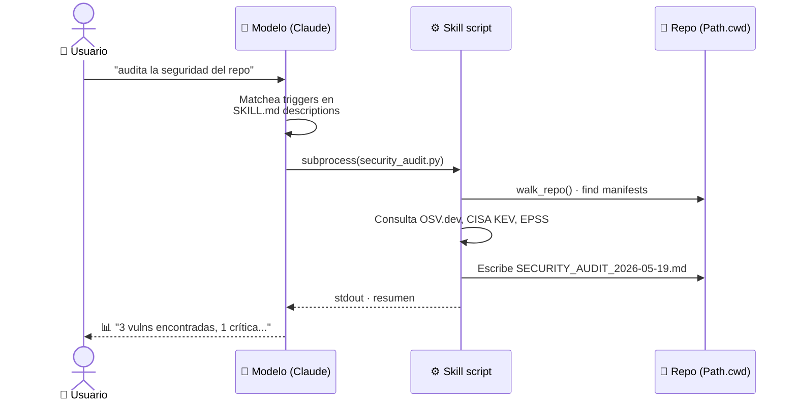
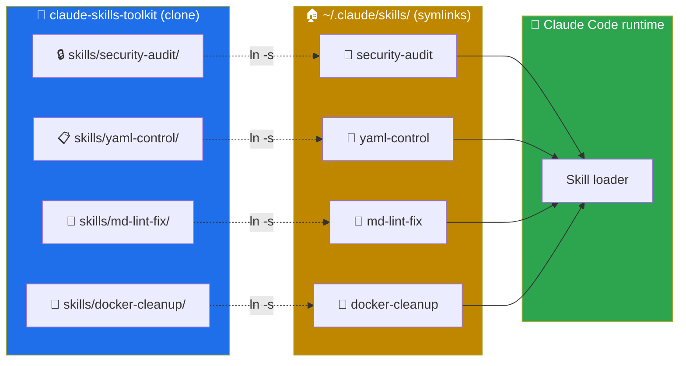
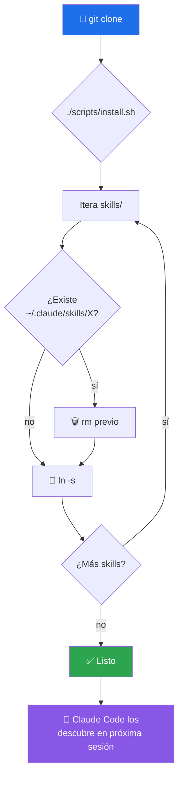
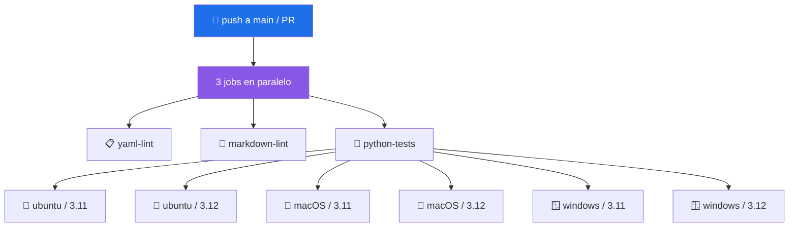

# 🏗️ Arquitectura

> Cómo está organizado `claude-skills-toolkit` por dentro, y por qué.

---

## 🌳 Vista en árbol

```text
claude-skills-toolkit/
├── 📘 README.md              ← entry point · catálogo + quick start
├── 📦 INSTALL.md             ← instalación / desinstalación / troubleshooting
├── 🤝 CONTRIBUTING.md        ← reglas para PRs
├── 📋 CHANGELOG.md           ← historial de versiones (Keep a Changelog)
├── 🗺️ ROADMAP.md             ← próximos hitos + no-objetivos
├── 🔐 SECURITY.md            ← política de seguridad
├── 🆘 SUPPORT.md             ← canales por tipo de problema
├── 🤗 CODE_OF_CONDUCT.md     ← Contributor Covenant 2.1
├── 💼 RECRUITER.md           ← qué demuestra este proyecto
├── 📄 LICENSE                ← MIT
│
├── 🛠️ scripts/
│   ├── install.sh         ← Linux/macOS/Git-Bash · symlinks idempotentes
│   ├── install.ps1        ← Windows PowerShell · symlink con fallback a copia
│   ├── uninstall.sh       ← solo remueve symlinks que apunten al repo
│   └── uninstall.ps1      ← idem, versión PowerShell
│
├── 🗂️ skills/                     (cada skill: SKILL.md + README.md + script)
│   ├── _template/         ← copia para crear skills nuevos
│   ├── 🔒 security-audit/         ← 12 capas · OSV/KEV/EPSS/SAST/... + cobertura real del scan
│   ├── 📋 yaml-control/           ← yaml + actionlint + convenciones repo
│   ├── 📝 md-lint-fix/            ← wrapper inteligente de markdownlint-cli2
│   ├── 🐳 docker-cleanup/         ← wipe completo de Docker (bash)
│   ├── 🩺 docker-compose-doctor/  ← análisis estático de compose.yml
│   ├── 🪝 pre-commit-guard/       ← orquestador pre-commit (yaml + md sobre staged, sin pytest)
│   ├── 🛡️ pre-push-guard/         ← orquestador pre-push (yaml + md + pytest)
│   ├── 📸 web-snap/               ← screenshots de URLs en Windows (Chrome/Edge + Pillow)
│   ├── 🐍 python-version-control/ ← audita drift de versión Python (12+ fuentes)
│   └── 🧭 repo-coherence-audit/   ← reconcilia docs↔repo (versión/tests/workflows/pins)
│
├── 🧪 tests/                 ← unittest, sin dependencias extras
│   ├── test_skills_structure.py        ← estructura: frontmatter + README + scripts
│   └── test_security_audit_coverage.py ← funcionales: compute_coverage happy paths
│
├── 📚 docs/
│   ├── architecture.md            ← este archivo
│   ├── skill-promotion.md         ← flujo local → toolkit
│   └── supply-chain-security.md   ← política npm/pnpm · Shai-Hulud
│
└── ⚙️ .github/
    └── workflows/
        ├── ci.yml         ← yaml-control + md-lint + tests cross-platform
        └── release.yml    ← tag v* → zip por skill + bundle + GitHub Release
```

---

## 🧠 Modelo mental

Un **skill** = un contrato + un ejecutable + docs humanas. El contrato vive en `SKILL.md` (frontmatter YAML con `name` + `description` + triggers — lo lee el agente); el ejecutable es Python o Bash; el `README.md` documenta para humanos (diagramas, casos de uso, limitaciones).

El runtime (Claude Code) carga todos los directorios bajo `~/.claude/skills/`. Cuando el usuario habla, el modelo compara la intención con cada `description` y decide invocar el skill apropiado.

### Flujo de invocación



### Topología de archivos



---

## 🎯 Decisiones de diseño

### 1️⃣ `Path.cwd()` en vez de paths embebidos

Los skills nunca asumen una ruta absoluta del autor. Todo lo relativo se calcula desde el directorio de trabajo actual. Esto permite que el mismo skill instalado una vez funcione en cualquier repositorio.

### 2️⃣ Symlinks en vez de copias

`install.sh` y `install.ps1` crean symlinks desde `~/.claude/skills/` hacia este repo.

| | Symlink | Copia |
|---|:-:|:-:|
| ✅ `git pull` actualiza | sí | requiere reinstalar |
| 🔥 Edición en caliente | sí | no |
| 🧹 Desinstalar limpio | sí | sí |
| 🪟 Funciona en Windows sin Dev Mode | no | sí (fallback) |

### 3️⃣ Cero dependencias por defecto

Los 10 skills funcionan con Python stdlib + herramientas estándar del SO (git, docker) — las excepciones (`pyyaml`, `pillow`, `markdownlint-cli2`) están documentadas por skill en [INSTALL.md](../INSTALL.md). Las capas avanzadas (Bandit, trivy, gitleaks, etc.) son **opt-in** y degradan silenciosamente si no están instaladas. El reporte deja constancia de qué capa se saltó y por qué.

### 4️⃣ Honestidad sobre limitaciones

Cada `SKILL.md` tiene una sección explícita **"Qué NO hace / limitaciones"**. Un skill que esconde sus límites genera bugs sutiles cuando el agente lo invoca en un contexto inadecuado.

### 5️⃣ Eat your own dog food

El propio repo se valida en CI con `yaml-control` y `markdownlint-cli2`. Si los skills no son suficientemente buenos para validar a su propio toolkit, no son suficientemente buenos para nadie.

---

## 🔄 Flujo de instalación



Idempotente: re-ejecutarlo reemplaza los symlinks viejos sin romper nada.

---

## ➕ Cómo añadir un skill nuevo

Ver [CONTRIBUTING.md](../CONTRIBUTING.md) para el workflow detallado. Resumen:


---

## ✅ Estado del CI

El workflow [`.github/workflows/ci.yml`](../.github/workflows/ci.yml) corre en cada push y PR a `main`:

| Job | Qué hace | Plataforma |
|---|---|---|
| 📋 `yaml-lint` | Ejecuta `yaml-control --all` + `actionlint` sobre el propio repo | 🐧 ubuntu-latest |
| 📝 `markdown-lint` | `markdownlint-cli2` sobre todos los `.md` (report-only) | 🐧 ubuntu-latest |
| 🧪 `python-tests` | `python -m unittest discover -s tests` (17 tests) | 🐧🍎🪟 ubuntu / macOS / windows · Python 3.11 + 3.12 |

## 🚀 Release automation

El workflow [`.github/workflows/release.yml`](../.github/workflows/release.yml) se dispara al pushear un tag `v*`:

1. Empaqueta **cada skill como zip individual** (`<skill>-vX.Y.Z.zip`).
2. Empaqueta el **bundle completo** del toolkit (skills + scripts + docs).
3. Extrae las release notes de la sección correspondiente del `CHANGELOG.md`.
4. Crea el GitHub Release con todos los assets (o actualiza los assets si ya existe).

Flujo de release: mover `[Unreleased]` → `[X.Y.Z]` en CHANGELOG → commit → `git tag -a vX.Y.Z` → `git push origin vX.Y.Z`. Todo lo demás es automático.

### Matriz de tests


