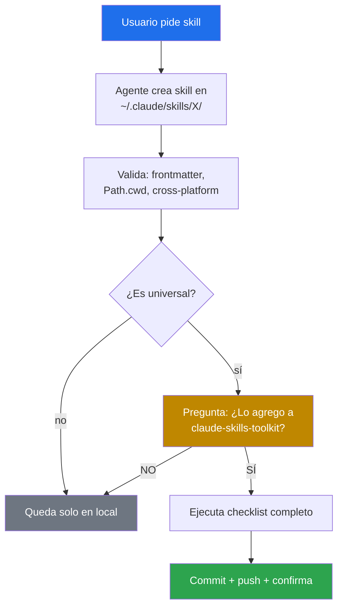

# 🚀 Promoción de skills

> Flujo formal para promover un skill desde `~/.claude/skills/<nombre>/` (uso personal) hasta `claude-skills-toolkit/skills/<nombre>/` (catálogo público del toolkit).

Este documento describe el contrato entre el autor y su agente de coding cuando un skill nuevo está listo para publicarse. Aplica también si lo escribes a mano — los pasos son los mismos.

---

## 🎯 Cuándo promover un skill

Un skill se promueve **sólo si es universal** — útil para cualquier developer en el mundo.

| ✅ Universal · promover | ❌ Específico · NO promover |
|---|---|
| Lint / format genérico (yaml, md, py, ts) | Atado a un proyecto interno (ferremarket, rootcause, portal-*) |
| Security audit / SAST / scan | Usa credenciales hardcoded o paths absolutos a tus repos |
| Refactoring genérico | Lógica de negocio de un cliente |
| DevOps / CI helpers (docker, k8s) | Scrapers de plataformas con tu sesión personal |
| Scaffolding (React, FastAPI, etc.) | Workflows internos no publicables |

Ante la duda, **pregunta al autor** antes de promover.

---

## 📋 Checklist de promoción

Cuando un skill se completa en `~/.claude/skills/<nombre>/` y se decide promoverlo:

### 1️⃣ Validación previa

- [ ] `SKILL.md` tiene **frontmatter YAML** con `name` + `description` (incluyendo triggers en ES + EN).
- [ ] El script funciona desde **`Path.cwd()`** — no asume rutas del autor. Los **ejemplos de la documentación** tampoco usan rutas ni nombres de repos personales (usa `/ruta/a/mi-proyecto`).
- [ ] **Cero dependencias** por defecto (las capas avanzadas son opt-in y degradan).
- [ ] **Cross-platform** o documenta su limitación explícitamente (ej. "requiere bash").
- [ ] Documenta **qué NO hace** y los riesgos conocidos.

### 2️⃣ Copia al repo

```bash
cp -r ~/.claude/skills/<nombre>/ ~/claude-skills-toolkit/skills/<nombre>/
```

(Copia, no move — el original sigue disponible para uso local.)

### 3️⃣ Actualizaciones en cascada

Cada promoción **debe** actualizar estos archivos:

| Archivo | Qué cambia |
|---|---|
| `skills/<nombre>/README.md` | **Crear** — documentación humana con secciones 🎯 Qué hace / 📦 Instalación / 🚀 Uso (obligatorias, el test las exige), idealmente con diagrama Mermaid y casos de uso. |
| `README.md` | Fila nueva en `## 🗂️ Catálogo` (enlazando al `README.md` del skill) con icono + LOC + triggers + deps. Badge `skills-N` incrementado. Icono nuevo al hero. |
| `CHANGELOG.md` | Entrada en `## 🚧 [Unreleased]` → `### ✨ Añadido`. |
| `ROADMAP.md` | Si el skill estaba en "Próximos hitos" o "Backlog", marcarlo `- [x]` y moverlo a "Estado actual". |
| `docs/architecture.md` | Añadir entrada al árbol bajo `🗂️ skills/`. |
| `tests/test_skills_structure.py` | Añadir `"<nombre>"` al set `PRODUCTION_SKILLS`. |
| `INSTALL.md` | Fila en la tabla "Dependencias por skill". |

### 4️⃣ Validación local

```bash
python -m unittest discover -s tests          # suite completa en verde (estructura + funcionales)
python skills/yaml-control/yaml_control.py --all   # 0 errores
```

Los tests estructurales validan automáticamente: frontmatter con `name`/`description`, `README.md` presente con las secciones obligatorias, y que el skill esté en `PRODUCTION_SKILLS`.

### 5️⃣ Commit + push

```bash
git add skills/<nombre>/ README.md CHANGELOG.md ROADMAP.md docs/architecture.md tests/
git commit -m "feat(skills): add <nombre> — <one-liner del propósito>"
git push origin main
```

Mensaje convencional: `feat(skills): add <nombre> — <propósito>`. En el body incluye triggers principales y dependencias.

### 6️⃣ Confirmación

Reportar al autor:

- Hash del commit.
- URL del commit (`https://github.com/vladimiracunadev-create/claude-skills-toolkit/commit/<sha>`).
- Link al run de CI (`https://github.com/vladimiracunadev-create/claude-skills-toolkit/actions`).

---

## 🤖 Contrato con el agente

Cuando el autor pide *"crea un skill que haga X"*, el agente:



**Regla de oro:** el agente **nunca** promueve sin preguntar explícitamente. La instalación local (`~/.claude/skills/`) es del usuario; la promoción al repo es una decisión editorial que el usuario toma caso a caso.

---

## 🗑️ Despromoción (caso raro)

Si un skill resulta no ser universal después de promoverse (ej. se descubre que tiene un acoplamiento implícito a un proyecto privado), se despromueve:

1. Crear branch `chore/depromote-<nombre>`.
2. Eliminar `skills/<nombre>/`.
3. Actualizar README, CHANGELOG (`### 🗑️ Removido`), ROADMAP, architecture.md, tests.
4. Documentar en el commit **por qué** ya no es universal.
5. Mover de vuelta a `~/.claude/skills/` si sigue siendo útil personalmente.

---

## 📚 Documentos relacionados

- [CONTRIBUTING.md](../CONTRIBUTING.md) — reglas generales para todos los contribuidores (incluye terceros).
- [docs/architecture.md](architecture.md) — anatomía interna del toolkit.
- [ROADMAP.md](../ROADMAP.md) — skills planeados que están esperando ser implementados y promovidos.
