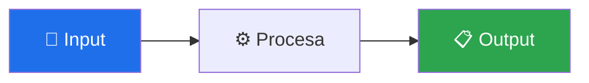

# 🧩 nombre-del-skill

> Una frase que resume qué hace y su diferencial. Ej: "Valida X en 3 capas — bloquea el push si Y está roto."


---

## 🎯 Qué hace

<!-- Obligatorio (el test estructural exige esta sección).
     Explica el problema que resuelve y cómo. Si el flujo tiene pasos,
     añade un diagrama Mermaid: -->



---

## 🚦 Cuándo se activa

**Triggers explícitos:**

- `"frase que el usuario diría"` · `"otra frase"`

**Triggers proactivos:**

- Situación en la que el agente debería invocarlo sin que se lo pidan

---

## 📦 Instalación

<!-- Obligatorio (el test estructural exige esta sección). -->

### Vía toolkit installer (recomendado)

```bash
git clone https://github.com/vladimiracunadev-create/claude-skills-toolkit.git ~/claude-skills-toolkit
cd ~/claude-skills-toolkit && ./scripts/install.sh
```

### Standalone

```bash
curl -L -o nombre-del-skill.zip \
  https://github.com/vladimiracunadev-create/claude-skills-toolkit/releases/latest/download/nombre-del-skill-vX.Y.Z.zip
unzip nombre-del-skill.zip -d ~/.claude/skills/nombre-del-skill/
```

---

## 🚀 Uso

<!-- Obligatorio (el test estructural exige esta sección). -->

```bash
python ~/.claude/skills/nombre-del-skill/main.py
```

| Flag | Qué hace |
|---|---|
| `--ejemplo` | Descripción |

**Exit codes:** `0` OK · `1` hallazgos/fallo · `2` error de invocación.

---

## 💡 Casos de uso reales

### 1. Escenario típico

```text
$ python ~/.claude/skills/nombre-del-skill/main.py
(output esperado — usa /ruta/a/mi-proyecto, nunca rutas personales)
```

---

## 🧰 Dependencias

| Dependencia | Requerida | Instalar con |
|---|:-:|---|
| Python 3.11+ | ✅ | sistema |

---

## ⚠️ Limitaciones

- Qué NO hace, explícitamente.
- Riesgos conocidos.

---

## 🔗 Skills relacionados

- [otro-skill](../otro-skill/README.md) — cómo se complementan

---

## 📚 Referencias

- [Documentación oficial de la herramienta subyacente](https://example.com)
