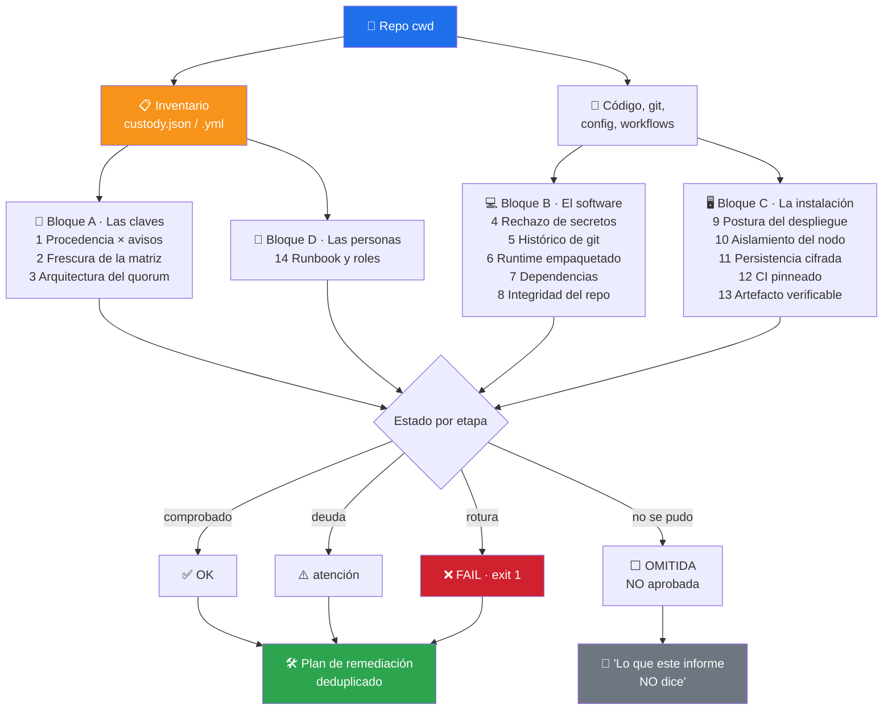

# ₿ bitcoin-custody-audit

> `security-audit` audita **el repositorio**. Este audita **la custodia**: de dónde vienen las claves, qué las puede romper, y si la instalación que las vigila está bien puesta. 14 etapas, cobertura declarada siempre, y una regla que no se negocia — **lo que no se pudo comprobar sale OMITIDO, nunca aprobado**.


---

## 🎯 Qué hace

Una custodia Bitcoin se rompe por sitios que ningún linter mira. No por un CVE en una
librería: por una semilla creada con un firmware que resultó tener un aviso, por un
multisig 3-de-3 donde perder un dispositivo es perder los fondos, por un
`rpcallowip=0.0.0.0/0` que alguien puso «un momento, para probar», o por descubrir
durante el incidente que nadie había decidido quién aprueba mover fondos.

Este skill recorre las **14 etapas** donde eso pasa, y en cada una declara **qué pudo
mirar realmente**.



### Las tres reglas

| | |
|---|---|
| 📏 **La cobertura se declara siempre** | Cada etapa dice qué miró y qué no. Un «0 hallazgos» sobre una superficie que nadie miró es una mentira con formato de informe. |
| ⬜ **OMITIDA ≠ aprobada** | Sin inventario, sin git o sin configuración son motivos legítimos para omitir. Ninguno lo es para aprobar. |
| 🕳️ **La ausencia de dato es un hallazgo** | No poder demostrar con qué firmware nació una clave **es** el problema, aunque la clave esté sana. |

> [!IMPORTANT]
> **Nunca pide, lee ni acepta material secreto.** No hay una sola ruta de código que
> consuma una semilla, una clave privada o una passphrase. El inventario son
> *metadatos* — fabricante, modelo, firmware, quorum —, jamás claves. Si el skill
> encuentra material secreto en el repositorio, lo **reporta**; no lo usa.

---

## 📦 Instalación

Viene con el toolkit:

```bash
git clone https://github.com/vladimiracunadev-create/claude-skills-toolkit.git ~/claude-skills-toolkit
cd ~/claude-skills-toolkit && ./scripts/install.sh
```

Cero dependencias externas: Python 3.11+ y `git` (opcional — sin git, la etapa 5 sale
OMITIDA). `pyyaml` solo si prefieres el inventario en YAML en vez de JSON.

---

## 🚀 Uso

```bash
# Las 14 etapas sobre el repo actual
python ~/.claude/skills/bitcoin-custody-audit/bitcoin_custody_audit.py

# Informe Markdown fechado en la raíz
python ~/.claude/skills/bitcoin-custody-audit/bitcoin_custody_audit.py --report

# Antes de un release: solo software y artefacto
python ~/.claude/skills/bitcoin-custody-audit/bitcoin_custody_audit.py --stages 4-8,13

# Tras tocar el despliegue: solo la instalación
python ~/.claude/skills/bitcoin-custody-audit/bitcoin_custody_audit.py --stages 9-11

# En CI: falla también si algo quedó sin evaluar
python ~/.claude/skills/bitcoin-custody-audit/bitcoin_custody_audit.py --json --strict
```

| Flag | Efecto |
|---|---|
| `--inventory PATH` | Inventario explícito. Por defecto busca `custody.json`, `bitcoin-custody.yml`, `.custody/inventory.*` |
| `--stages LISTA` | `1,2,3` o `9-13`. Por defecto: las 14 |
| `--deep` | Etapa 5 sobre el histórico completo (por defecto: últimos 2000 commits) |
| `--report` | Escribe `SECURITY_AUDIT_BITCOIN_<fecha>.md` |
| `--out-dir DIR` | Directorio del informe |
| `--json` | Salida procesable con etapas, hallazgos y plan |
| `--strict` | Exit 1 también si alguna etapa quedó OMITIDA |

También conversacionalmente, desde Claude Code:

```text
> audita mi custodia bitcoin
> ¿me afecta el aviso de COLDCARD que salió ayer?
> revisa la postura de seguridad del despliegue
```

---

## 📋 El inventario

Las etapas 1-3 y parte de la 6 y la 14 necesitan saber **qué custodias**. Eso vive en
un fichero de metadatos que tú mantienes:

```json
{
  "advisories_reviewed": "2026-08-01",
  "roles": {
    "aprueba_mover_fondos": "dos de los tres titulares, presencialmente",
    "custodia_firmante_c": "caja de seguridad bancaria"
  },
  "wallets": [
    {"id": "tesoreria", "quorum": "2-de-3", "value_tier": "high",
     "signers": ["cc-a", "tz-b", "led-c"]}
  ],
  "signers": [
    {"id": "cc-a", "vendor": "coldcard", "model": "Mk4",
     "firmware_at_seed": "5.1.2", "seed_created": "2024-03-11",
     "entropy_source": "device"}
  ],
  "advisories": [
    {"id": "CC-2023-01", "vendor": "coldcard", "models": ["Mk3"],
     "firmware_affected": "<4.1.0", "severity": "high",
     "url": "https://ejemplo.invalid/aviso"}
  ]
}
```

El cruce firmante × aviso tiene tres resultados, no dos:

| Resultado | Cuándo | Código |
|---|---|---|
| **Afectado** | el firmware del firmante cae dentro del rango del aviso | `F-PROV-AVISO` |
| **No afectado** | queda fuera del rango, con datos suficientes para decidirlo | — |
| **Indecidible** | falta `firmware_at_seed` o el aviso no acota versiones | `W-PROV-INDECIDIBLE` |

Ese tercer estado es el corazón del skill: **lo indecidible no se resuelve como
«no afectado»**. Se reporta como lo que es — un hueco de información que impide
descartar el riesgo.

---

## 🔎 Ejemplo de salida

```text
COBERTURA   : 8/14 etapas ejecutadas · 6 OMITIDAS (no evaluadas, NO aprobadas)
RESULTADO   : 0 OK · 0 con atención · 8 fallidas

-- Bloque A · Las claves ----------------------------------------------
XX   1. Procedencia de claves y firmantes
       cobertura: 5 firmantes · 4 con procedencia completa · 2 avisos cruzados
       - [F-PROV-INCOMPLETA] firmante `cc-b`: sin declarar firmware_at_seed
       - [F-PROV-AVISO] firmante `cc-c` (coldcard mk3, fw 3.9.0) cae dentro del aviso CC-2023-01
XX   3. Arquitectura de custodia
       - [F-ARQ-SINGLESIG-ALTO] wallet `cold-alto` es single-sig con valor declarado high
       - [F-ARQ-N-DE-N] wallet `tesoreria` usa quorum 3-de-3: perder un firmante es perder los fondos
       - [W-ARQ-MONOCULTIVO] wallet `tesoreria`: los 3 firmantes son del mismo fabricante (coldcard)

ETAPAS OMITIDAS — lo que este informe NO dice nada sobre:
  ..   5. Secretos en el histórico — no es un repositorio git: no hay histórico que revisar
```

El informe Markdown cierra siempre con dos secciones que la mayoría de auditorías se
saltan: **el plan de remediación deduplicado** (cada acción una vez, con todos los
sitios donde aplicarla) y **las etapas omitidas** con el motivo de cada una.

---

## 🔗 Relación con los otros skills

| Skill | Reparto |
|---|---|
| [`security-audit`](../security-audit/README.md) | Audita el **repositorio** (CVE, SAST, contenedor, secretos genéricos). Córrelo **primero**: la etapa 6 de aquí no consulta la red y delega en él la revisión de avisos del runtime. |
| [`python-deps-pinning`](../python-deps-pinning/README.md) | La etapa 7 usa su mismo razonamiento: sin lockfile no hay versión que consultar, luego esa superficie no está auditada. |
| [`yaml-control`](../yaml-control/README.md) | La etapa 12 comprueba pins a SHA y `permissions:`; `yaml-control` valida los workflows a fondo. |
| [`repo-coherence-audit`](../repo-coherence-audit/README.md) | La etapa 7 detecta el caso concreto de «la doc promete cero dependencias y el manifest declara doce»; aquel reconcilia todas las afirmaciones del repo. |

---

## ⚠️ Límites explícitos

- **No verifica la procedencia que le cuentas.** Si el inventario registra un firmware
  incorrecto, el diagnóstico será incorrecto. Ningún programa puede comprobar qué
  firmware tenía un dispositivo hace dos años.
- **La matriz de avisos es manual y local.** El skill detecta que está vieja; no la
  actualiza, y **no accede a la red**.
- **La etapa 4 es estática.** Lee el código, no ejecuta la aplicación. La versión fuerte
  de esa comprobación se hace contra la app en marcha, antes de cada release.
- **La etapa 5 no confirma frases mnemónicas.** Detecta la *forma* (12/15/18/21/24
  palabras seguidas) sin la wordlist BIP39: sale como heurística para revisar a mano,
  nunca como certeza.
- **Las etapas 9-11 leen configuración versionada**, no procesos en ejecución.
- **No mira la cadena.** Sin análisis de UTXO, reutilización de direcciones ni
  contrapartes: decisión de alcance, no carencia.
- **No sustituye** una auditoría criptográfica ni un proceso profesional de respuesta a
  incidentes.

---

## 📚 Referencias

- [SKILL.md](SKILL.md) — contrato para el agente (triggers y las 14 etapas).
- [`security-audit`](../security-audit/README.md) — el hermano de repositorio, 12 capas.
- [rootcause-bitcoin-defense](https://github.com/vladimiracunadev-create/rootcause-bitcoin-defense)
  — la aplicación de escritorio watch-only de donde salió el modelo de 14 etapas.
