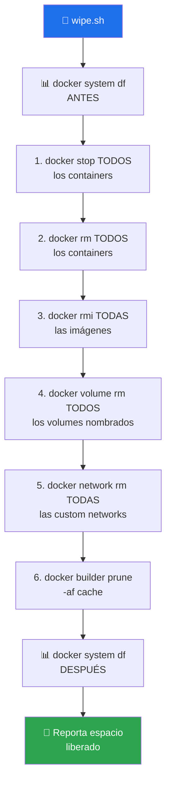

# 🐳 docker-cleanup

> Wipe completo de Docker en un solo comando — containers + images + volumes + custom networks + build cache. Idempotente, sin confirmaciones intermedias.


---

## 🎯 Qué hace

Un solo comando para dejar Docker "de fábrica" — útil cuando el disco se llena, un cambio de red no propaga, o simplemente quieres empezar limpio.



**Idempotente**: re-ejecutarlo sobre un Docker ya vacío es un no-op. **Sin confirmaciones**: cuando invocas este skill ya decidiste hacerlo.

---

## 🚦 Cuándo se activa

**Triggers explícitos (ES/EN):**

- `"limpia docker"` · `"deja docker vacío"` · `"borra todas las imágenes docker"`
- `"wipe docker"` · `"docker prune todo"` · `"vacía el docker"` · `"reset docker"`

---

## 📦 Instalación

### Vía toolkit installer (recomendado)

```bash
git clone https://github.com/vladimiracunadev-create/claude-skills-toolkit.git ~/claude-skills-toolkit
cd ~/claude-skills-toolkit && ./scripts/install.sh
```

### Standalone

```bash
curl -L -o docker-cleanup.zip \
  https://github.com/vladimiracunadev-create/claude-skills-toolkit/releases/latest/download/docker-cleanup-v0.2.0.zip
unzip docker-cleanup.zip -d ~/.claude/skills/docker-cleanup/
chmod +x ~/.claude/skills/docker-cleanup/scripts/wipe.sh
```

---

## 🚀 Uso

### Linux · macOS · Git Bash

```bash
bash ~/.claude/skills/docker-cleanup/scripts/wipe.sh
```

### Windows PowerShell (via Git Bash)

```bash
bash "$(cygpath ~)/.claude/skills/docker-cleanup/scripts/wipe.sh"
```

---

## 💡 Casos de uso reales

### 1. Disco lleno tras semanas de builds

```bash
$ bash ~/.claude/skills/docker-cleanup/scripts/wipe.sh
=== ANTES ===
TYPE            TOTAL   ACTIVE   SIZE      RECLAIMABLE
Images          47      3        12.4GB    11.8GB (95%)
Containers      12      2        450MB     420MB  (93%)
Local Volumes   28      4        3.2GB     2.9GB  (90%)
Build Cache     183     0        4.1GB     4.1GB  (100%)

Stopping 12 containers... done
Removing 12 containers... done
Removing 47 images... done
Removing 28 volumes... done
Removing 4 custom networks... done
Pruning build cache... done

=== DESPUÉS ===
TYPE            TOTAL   ACTIVE   SIZE   RECLAIMABLE
Images          0       0        0B     0B
Containers      0       0        0B     0B
Local Volumes   0       0        0B     0B
Build Cache     0       0        0B     0B

💾 Espacio liberado: ~20.2 GB
```

### 2. Reset tras cambio de red / VPN

Cuando cambiar de red rompe networking Docker, es más rápido wipear y `docker compose up --build` que debuggear routing tables.

### 3. Antes de un demo limpio

Estado predecible para grabar tutoriales o hacer live-coding sin residuos de sesiones anteriores.

---

## 🧬 Cómo funciona por dentro

El script `scripts/wipe.sh` ejecuta 6 pasos en orden estricto:

1. `docker stop $(docker ps -aq)` — detiene todos los containers
2. `docker rm $(docker ps -aq)` — elimina todos los containers
3. `docker rmi -f $(docker images -aq)` — elimina todas las imágenes (tagged + dangling)
4. `docker volume rm $(docker volume ls -q)` — elimina volumes nombrados
5. `docker network rm $(docker network ls --filter type=custom -q)` — elimina networks custom
6. `docker builder prune -af` — limpia el build cache

**Antes y después** imprime `docker system df` para mostrar el impacto visualmente.

---

## 🧰 Dependencias

| Dependencia | Requerida | Instalar con |
|---|:-:|---|
| Docker CLI | ✅ | Docker Desktop / paquete oficial |
| `bash` | ✅ | sistema (Git Bash en Windows) |

Sin dependencias Python. **El único skill del toolkit escrito en Bash puro.**

---

## ⚠️ Qué NO hace

- ❌ **No desinstala Docker**.
- ❌ **No toca redes default** (`bridge`, `host`, `none`) — Docker las recrea al arranque.
- ❌ **No cierra sesión** en registries; credenciales permanecen.
- ❌ **No pide confirmación** — invocación = ejecución. La decisión ya se tomó.

## 🔥 Failure modes

| Error | Solución |
|---|---|
| `cannot connect to Docker daemon` | Iniciar Docker Desktop / `systemctl start docker` |
| `volume in use by container X` | El script sigue con el resto — usualmente es un container externo (ej. Portainer) |

---

## 🔗 Skills relacionados

- [🩺 docker-compose-doctor](../docker-compose-doctor/README.md) — analiza el `compose.yml` antes de re-levantar el stack

---

## 📚 Referencias

- [`docker system prune`](https://docs.docker.com/reference/cli/docker/system/prune/) — versión oficial más suave (mantiene volumes)
- [Reclaiming disk space](https://docs.docker.com/config/pruning/) — guía oficial
