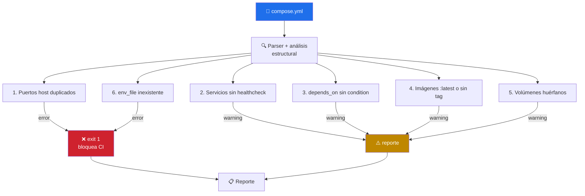
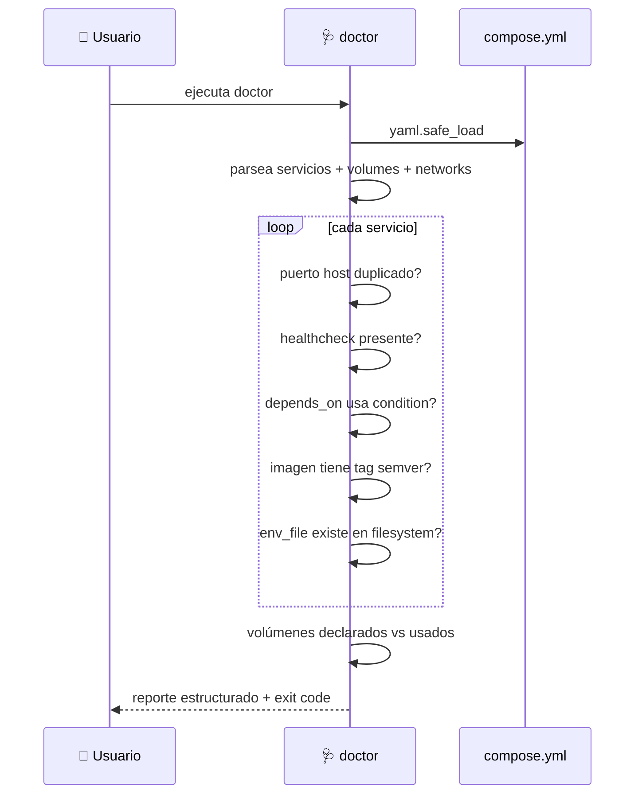

# 🩺 docker-compose-doctor

> Análisis estático de `compose.yml` — detecta **6 clases de problemas operacionales** que el schema oficial no captura. Cero deps más allá de `pyyaml`.


---

## 🎯 Qué hace

No reemplaza a `docker compose config` (que valida el schema). Cubre la capa de **convenciones operacionales** que hacen que un stack levante sano vs quede en un estado "up pero rot".



### Los 6 checks

| # | Check | Severidad | Por qué importa |
|---|---|:-:|---|
| 1 | **Puertos host duplicados** entre servicios | ❌ error | El segundo bind falla → stack no levanta |
| 2 | Servicios sin `healthcheck` | ⚠️ warning | Sin healthcheck `depends_on: service_healthy` no funciona |
| 3 | `depends_on` simple cuando el target tiene healthcheck | ⚠️ warning | Race classic: app arranca antes que la DB acepte conexiones |
| 4 | Imágenes con `:latest` o sin tag | ⚠️ warning | Builds no reproducibles |
| 5 | Volúmenes nombrados declarados pero no usados | ⚠️ warning | Dead config, típicamente residuo de refactors |
| 6 | `env_file` apuntando a archivo inexistente | ❌ error | Falla en `up` — frecuente al renombrar `.env.example` |

---

## 🚦 Cuándo se activa

**Triggers explícitos:**

- `"revisa el compose"` · `"valida docker-compose"` · `"qué tiene mal este compose"`
- `"docker compose lint"` · `"auditar compose.yml"` · `"chequea el stack"`
- `"por qué no levanta este compose"` · `"doctor del compose"`

**Triggers proactivos:**

- Editaste cualquier `compose*.y*ml` en la sesión
- Antes de `docker compose up` cuando hay problemas de orden o puertos

---

## 📦 Instalación

### Vía toolkit installer (recomendado)

```bash
git clone https://github.com/vladimiracunadev-create/claude-skills-toolkit.git ~/claude-skills-toolkit
cd ~/claude-skills-toolkit && ./scripts/install.sh
```

### Standalone

```bash
curl -L -o docker-compose-doctor.zip \
  https://github.com/vladimiracunadev-create/claude-skills-toolkit/releases/latest/download/docker-compose-doctor-v0.2.0.zip
unzip docker-compose-doctor.zip -d ~/.claude/skills/docker-compose-doctor/
pip install pyyaml
```

---

## 🚀 Uso

### Modo básico — busca compose automáticamente

```bash
python ~/.claude/skills/docker-compose-doctor/docker_compose_doctor.py
```

Busca `compose.yml`, `compose.yaml`, `docker-compose.yml`, `docker-compose.yaml` en `Path.cwd()` recursivamente hasta 3 niveles.

### Opciones

| Flag | Qué hace |
|---|---|
| `<path>` | Archivo específico |
| `--errors-only` | Omite warnings, solo errores |
| `--json` | Output JSON (integrable) |
| `-v` | Verbose — muestra cada check ejecutado |

**Exit codes:** `0` sin hallazgos o solo warnings · `1` al menos un error · `2` error de invocación (no existe, YAML malformado).

---

## 💡 Casos de uso reales

### 1. Compose con problemas — antes de `up`

```text
$ python ~/.claude/skills/docker-compose-doctor/docker_compose_doctor.py
docker-compose-doctor — repo: C:/dev/ferremarket
  archivo: compose.yml (5 servicios)

[errors]
  ✗ Puerto host 8080 duplicado entre 'api' y 'admin'
    api:    "8080:8000"  (línea 14)
    admin:  "8080:80"    (línea 41)
  ✗ env_file inexistente en 'worker': ./envs/worker.env (línea 67)

[warnings]
  ⚠ 'api' sin healthcheck — depends_on no podrá esperar service_healthy
  ⚠ 'worker' depende de 'db' con depends_on simple. Sugerencia:
        depends_on:
          db:
            condition: service_healthy
  ⚠ Imagen 'redis' sin tag (línea 52) — pinnea a 'redis:7.2-alpine'
  ⚠ Volumen 'old_cache' declarado pero no referenciado

Resumen: 2 errores, 4 warnings.
```

Exit `1` — bloquea `docker compose up` en CI.

### 2. Estado limpio

```text
docker-compose-doctor — archivo: compose.yml (5 servicios)
  ✓ Puertos: sin conflictos
  ✓ Healthchecks: 5/5 cubiertos
  ✓ depends_on: todas usan condition apropiada
  ✓ Imágenes: todas pinneadas
  ✓ Volúmenes: sin huérfanos
  ✓ env_file: todos los archivos existen

Resumen: 0 errores, 0 warnings. OK para `docker compose up`.
```

### 3. Integración con `pre-push-guard`

`pre-push-guard` invoca `yaml-control` primero (sintaxis) y luego este skill (semántica). Un compose pasa por ambas capas antes de que el push proceda.

---

## 🧬 Cómo funciona por dentro



---

## 🧰 Dependencias

| Dependencia | Requerida | Instalar con |
|---|:-:|---|
| Python 3.11+ | ✅ | sistema |
| `pyyaml` | ✅ | `pip install pyyaml` |

**Sin binarios externos.** No invoca `docker` ni `docker compose`.

---

## ⚠️ Limitaciones

- **No valida el schema Compose** — asume que `docker compose config` ya pasó. Es complementario, no sustituto.
- **No ejecuta el stack** — análisis estático puro. Un healthcheck que devuelve 200 pero la app está rota internamente no lo detecta.
- **No resuelve `${VAR}` de entorno** — si `image: ${MY_IMAGE}` no tiene tag literal, no se reporta como latest (no se puede saber).
- **No valida redes custom** — fuera del scope MVP. Puede llegar en versión futura.
- **`extends:` / `include:` solo a un nivel** — anidados profundos pueden dar falsos negativos.

---

## 🔗 Skills relacionados

- [📋 yaml-control](../yaml-control/README.md) — sintaxis YAML (capa 1); este skill corre después
- [🐳 docker-cleanup](../docker-cleanup/README.md) — wipe completo si necesitas reset
- [🛡️ pre-push-guard](../pre-push-guard/README.md) — orquesta yaml-control + doctor + tests

---

## 📚 Referencias

- [Compose Specification](https://compose-spec.io/) — schema oficial
- [`docker compose config`](https://docs.docker.com/reference/cli/docker/compose/config/) — validador oficial complementario
- [depends_on with condition](https://docs.docker.com/reference/compose-file/services/#depends_on) — patrón correcto de dependencias
