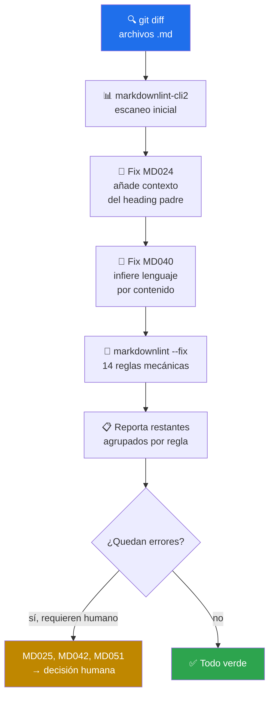

# 📝 md-lint-fix

> Wrapper inteligente sobre `markdownlint-cli2` — auto-corrige 14 reglas, resuelve **MD024** con contexto del heading padre y **MD040** infiriendo lenguaje del bloque. Reporta el resto para criterio humano.


---

## 🎯 Qué hace

Detecta `.md` modificados según `git`, escanea con `markdownlint-cli2` y aplica una cadena de fixes:



**La magia está en MD024 y MD040** — reglas que `--fix` estándar no resuelve porque requieren *entender el contenido*. Este skill:

- **MD024** (duplicate headings): añade el nombre del heading padre para desambiguar. `## Setup` bajo `# Windows` y bajo `# Linux` se convierte en `## Setup (Windows)` y `## Setup (Linux)`.
- **MD040** (fenced code sin lenguaje): analiza el contenido del bloque (`import`, `SELECT`, `{}`, etc.) e infiere `python`/`sql`/`json`/`bash`/`yaml`/`hcl`.

---

## 🚦 Cuándo se activa

**Triggers explícitos:**

- `"arregla el lint MD"` · `"corrige los markdown"` · `"limpia los .md"`
- `"fix markdownlint"` · `"errores MD024/MD040/MD031"`

**Triggers proactivos:**

- Editaste `.md` en la sesión actual
- CI falló con `markdownlint`
- Antes de commitear docs

---

## 📦 Instalación

### Vía toolkit installer (recomendado)

```bash
git clone https://github.com/vladimiracunadev-create/claude-skills-toolkit.git ~/claude-skills-toolkit
cd ~/claude-skills-toolkit && ./scripts/install.sh
```

### Standalone

```bash
curl -L -o md-lint-fix.zip \
  https://github.com/vladimiracunadev-create/claude-skills-toolkit/releases/latest/download/md-lint-fix-v0.2.0.zip
unzip md-lint-fix.zip -d ~/.claude/skills/md-lint-fix/
```

### `markdownlint-cli2` en el repo destino

**Recomendado: `pnpm`** (postinstall bloqueado por defecto + cuarentena 24h — ver [supply-chain-security](../../docs/supply-chain-security.md)).

```bash
pnpm add -D markdownlint-cli2
```

Alternativas (menos defensas por defecto):

```bash
npm install --save-dev --ignore-scripts markdownlint-cli2
yarn add -D markdownlint-cli2
```

Si el repo no lo tiene, `pnpm dlx markdownlint-cli2` (o `npx`) lo descarga on-the-fly.

---

## 🚀 Uso

### Modo básico — .md modificados

```bash
python ~/.claude/skills/md-lint-fix/fix-md-lint.py
```

### Opciones

| Flag | Qué hace |
|---|---|
| `--all` | Todos los `.md` del repo (no solo modificados) |
| `--dry-run` | Reporta sin escribir cambios |

---

## 💡 Casos de uso reales

### 1. Auto-fix pre-commit

```bash
$ python ~/.claude/skills/md-lint-fix/fix-md-lint.py
md-lint-fix — repo: C:/dev/mi-proyecto
  scope: 3 archivos modificados (README.md, CHANGELOG.md, docs/setup.md)

[1/3] README.md
  Errores iniciales: 8 (MD024×2, MD040×3, MD031×2, MD034×1)
  ✓ MD024 resuelto: "Setup" → "Setup (Windows)" / "Setup (Linux)"
  ✓ MD040 resuelto: bloque línea 45 inferido como `python`
  ✓ --fix mecánico: 5 reglas más
  Errores restantes: 0

[2/3] CHANGELOG.md
  Errores iniciales: 2 (MD025×1, MD032×1)
  ✓ --fix: MD032
  ⚠ MD025 restante (múltiples H1) — requiere reestructura

[3/3] docs/setup.md
  ✓ todo OK

Resumen: 2 archivos limpios, 1 requiere revisión humana.
```

### 2. Auditoría del repo completo

```bash
python ~/.claude/skills/md-lint-fix/fix-md-lint.py --all
```

### 3. Sólo diagnóstico

```bash
python ~/.claude/skills/md-lint-fix/fix-md-lint.py --dry-run
```

---

## 🧬 Reglas que resuelve

| Código | Descripción | Cómo |
|---|---|---|
| **MD024** | Duplicate headings | 🧠 Script propio con contexto de padre |
| **MD040** | Fenced code sin lenguaje | 🧠 Script propio infiere por contenido |
| MD031 | Blank lines around fences | 🔧 `--fix` |
| MD032 | Lists surrounded by blank lines | 🔧 `--fix` |
| MD034 | Bare URL used | 🔧 `--fix` (envuelve en `<>`) |
| MD028 | Blank line inside blockquote | 🔧 `--fix` |
| MD027 | Multiple spaces after blockquote | 🔧 `--fix` |
| MD022 | Headings not surrounded by blank lines | 🔧 `--fix` |
| MD026 | Trailing punctuation in heading | 🔧 `--fix` |
| MD029 | Ordered list item prefix | 🔧 `--fix` |
| MD030 | Spaces after list markers | 🔧 `--fix` |
| MD009 | Trailing spaces | 🔧 `--fix` |
| MD012 | Multiple consecutive blank lines | 🔧 `--fix` |
| MD047 | Single trailing newline | 🔧 `--fix` |

**Requieren criterio humano (solo se reportan):**

- MD025 — múltiples H1 (implica reestructura)
- MD014 — `$` antes de comandos (decisión de estilo)
- MD042 — enlaces vacíos (requiere URL real)
- MD051 — fragmentos rotos (requiere verificar ancla)
- MD013 — line length
- MD033 — inline HTML

---

## 🧰 Dependencias

| Dependencia | Requerida | Instalar con |
|---|:-:|---|
| Python 3.11+ | ✅ | sistema |
| `markdownlint-cli2` | ✅ | `pnpm add -D markdownlint-cli2` |
| `pnpm` v11+ | recomendado | ver [supply-chain-security](../../docs/supply-chain-security.md) |

---

## ⚠️ Limitaciones

- **No entiende Markdown extendido específico de un renderer** (Docusaurus admonitions, Hugo shortcodes, etc.) — los detecta como MD033 (inline HTML) y los deja pasar si tu config lo permite.
- **MD024 con inferencia de contexto puede ser ambigua** cuando dos headings iguales no tienen padre distinguible. En ese caso lo reporta como pendiente.
- **Requiere Node/pnpm** — la única dep no-Python del toolkit.

---

## 🔗 Skills relacionados

- [🪝 pre-commit-guard](../pre-commit-guard/README.md) — invoca md-lint-fix `--dry-run` sobre staged
- [🛡️ pre-push-guard](../pre-push-guard/README.md) — invoca sobre el diff vs origin

---

## 📚 Referencias

- [markdownlint rules](https://github.com/DavidAnson/markdownlint/blob/main/doc/Rules.md)
- [markdownlint-cli2](https://github.com/DavidAnson/markdownlint-cli2)
- [Supply chain security policy](../../docs/supply-chain-security.md) — por qué pnpm sobre npm
