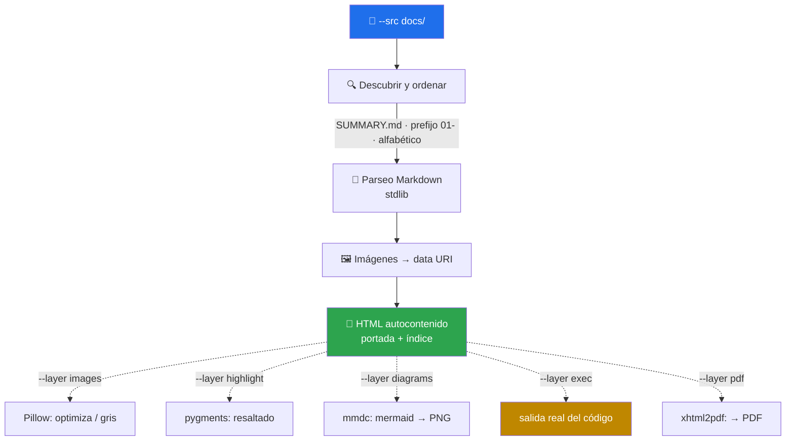

# 📄 md-to-doc

> Convierte cualquier árbol de Markdown en **un solo fichero** HTML autocontenido — o en PDF. Núcleo sin dependencias; todo lo demás son capas que se piden y degradan solas.


---

## 🎯 Qué hace

Junta los `.md` de un directorio, los ordena, y emite un documento con portada e índice navegable. Las imágenes van **embebidas como data URI**, así que el resultado viaja solo: se puede mover, adjuntar o subir sin arrastrar una carpeta de assets detrás.



### Los dos problemas que ataca

**1. Documentos que no son autocontenidos.** Un HTML exportado que referencia `./img/diagrama.png` se rompe en cuanto sale de su carpeta. Aquí no hay rutas relativas que romper.

**2. Diagramas que desaparecen al exportar.** GitHub renderiza los fences ` ```mermaid ` de forma nativa, así que se escriben sin pensarlo. Al pasar a PDF no los renderiza nadie:

| Sin `--layer diagrams` | Con `--layer diagrams` |
|---|---|
| El diagrama sale como un bloque de texto plano | Se convierte a PNG y se embebe |
| El lector ve `flowchart LR; A-->B` | El lector ve el diagrama |

---

## 📦 Instalación

Viene con el toolkit:

```bash
git clone https://github.com/vladimiracunadev-create/claude-skills-toolkit.git ~/claude-skills-toolkit
cd ~/claude-skills-toolkit && ./scripts/install.sh
```

El núcleo no necesita nada más que Python 3.11+. Las capas, según lo que uses:

```bash
pip install pillow pygments xhtml2pdf          # images · highlight · pdf
pnpm add -g @mermaid-js/mermaid-cli            # diagrams
```

---

## 🚀 Uso

```bash
# Núcleo puro — cero dependencias
python ~/.claude/skills/md-to-doc/md_to_doc.py --src docs --out manual.html

# Documentación completa con diagramas y código resaltado
python ~/.claude/skills/md-to-doc/md_to_doc.py --src docs \
    --layer diagrams --layer highlight \
    --title "Manual de operaciones" --subtitle "v2.1"

# Listo para imprimir en blanco y negro
python ~/.claude/skills/md-to-doc/md_to_doc.py --src docs --profile print \
    --layer images --layer diagrams --layer pdf --out manual.pdf
```

Conversacionalmente desde Claude Code:

```text
> genera un PDF con toda la documentación del repo
  → 📄 invoca md-to-doc · compila docs/ con diagramas renderizados

> los diagramas no salen en el PDF que generamos
  → 📄 invoca md-to-doc --layer diagrams · los convierte a imagen antes de componer
```

---

## 🧱 Las capas

Principio de diseño: **el núcleo nunca depende de nada**. Cada capa se pide explícitamente y, si su herramienta no está instalada, el documento se genera igual — con el aviso impreso en consola y en una sección del propio documento.

| Capa | Herramienta | Qué añade | Si falta |
|---|---|---|---|
| *(núcleo)* | stdlib | Parseo, portada, índice, imágenes embebidas | — |
| `images` | `pillow` | Optimiza; gris en perfil `print` | Imágenes sin optimizar |
| `highlight` | `pygments` | Resaltado de sintaxis | Código sin colorear |
| `diagrams` | `mmdc` | Mermaid → PNG, **caché por hash** | Quedan como texto |
| `exec` | — | Salida **real** del código | Capa inactiva |
| `pdf` | `xhtml2pdf` | HTML → PDF | Se emite solo HTML |

### 🔥 La capa `exec` — documentación que no miente

Un bloque marcado se ejecuta y su salida real se inserta debajo:

~~~markdown
```python run
total = sum(range(1, 11))
print(f"La suma de 1..10 es {total}")
```
~~~

Produce el código **y** la consola con `La suma de 1..10 es 55`. La diferencia con escribir el resultado a mano es que este no puede quedar obsoleto: si el código cambia y deja de dar 55, el documento lo refleja en la siguiente compilación.

> ⚠️ **Ejecuta código del Markdown de origen.** Está detrás de `--layer exec` (desactivada por defecto), avisa por `stderr` al arrancar, corre con `python -I` —aislado de `PYTHONPATH` y del `site` del usuario— y con timeout configurable. Aun así, úsala solo sobre fuentes en las que confías.

### 💾 La caché de diagramas

Cada diagrama se cachea por `sha256` de su contenido. Uno que no cambió entre dos compilaciones no se vuelve a renderizar — importa, porque `mmdc` arranca un Chromium en cada invocación.

---

## 📑 Orden de los documentos

Por precedencia:

1. El fichero pasado en `--order` (un path por línea).
2. `SUMMARY.md` en el directorio origen — convención mdBook / GitBook.
3. Prefijo numérico (`01-`, `02-`…) y después alfabético.

---

## ⚠️ Límites explícitos

| Límite | Detalle |
|---|---|
| No es CommonMark completo | Cubre encabezados, párrafos, énfasis, código, listas, tablas, citas, reglas, enlaces e imágenes. No: listas anidadas multinivel, notas al pie, HTML crudo |
| No descarga imágenes remotas | Una `` queda como enlace — y se reporta que el documento deja de ser autocontenido ahí |
| `exec` solo ejecuta Python | Otros lenguajes se ignoran con aviso |
| El PDF hereda los límites de `xhtml2pdf` | Soporte CSS parcial. Para tipografía compleja o emoji, revisa el resultado |
| Solo lectura | No modifica los `.md` de origen |

---

## 📚 Referencias

- Mermaid CLI: <https://github.com/mermaid-js/mermaid-cli>
- Pygments: <https://pygments.org/>
- xhtml2pdf: <https://xhtml2pdf.readthedocs.io/>
- Política de dependencias Node del toolkit: [docs/supply-chain-security.md](../../docs/supply-chain-security.md)
