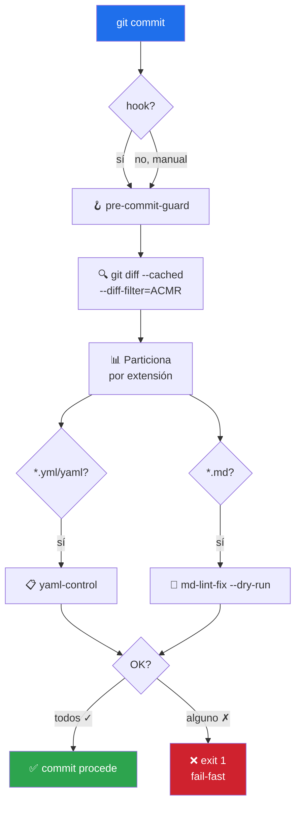

# 🪝 pre-commit-guard

> Gemelo rápido de [pre-push-guard](../pre-push-guard/README.md) sobre archivos **staged**. Corre `yaml-control` + `md-lint-fix --dry-run` sobre `git diff --cached` antes de cada commit. **Objetivo < 2s** — no corre pytest.


---

## 🎯 Qué hace

Bloquea que un YAML roto o Markdown malformado entre al historial local. Es el **primer anillo de defensa** — hermano rápido de `pre-push-guard`.



### Por qué existe (y por qué no basta con pre-push-guard)

`pre-push-guard` cubría "antes de compartir con otros". Pero commit y push suceden en momentos distintos:

| | pre-commit-guard | pre-push-guard |
|---|---|---|
| ⏱️ Cuándo dispara | Cada `git commit` | Cada `git push` |
| 🎯 Alcance | Solo staged (lo que entra al commit) | Diff vs `origin/<branch>` + working tree |
| 🧪 Corre pytest | **No** — solo lint | Sí (si hay `.py` + `tests/`) |
| ⚡ Objetivo de tiempo | < 2s | < 30s |
| 🛑 Qué bloquea | Un commit **malformado** entrando al historial | Que se **comparta** con otros |

**Sin este skill**, un YAML roto entra al historial local y hay que arreglarlo con `git commit --amend` o rebase. Con este skill el commit se aborta antes: arregla, `git add`, reintenta.

---

## 🚦 Cuándo se activa

**Triggers explícitos:**

- `"valida antes de commitear"` · `"chequea antes del commit"` · `"pre-commit"`
- `"guard antes de commit"` · `"lint antes de commit"` · `"instala pre-commit hook"`

**Triggers proactivos:**

- Justo antes de `git commit` con archivos staged `.yml`/`.yaml`/`.md`
- Después de que el usuario tuvo que hacer `git commit --amend` por un lint error obvio

---

## 📦 Instalación

### Vía toolkit installer (recomendado)

```bash
git clone https://github.com/vladimiracunadev-create/claude-skills-toolkit.git ~/claude-skills-toolkit
cd ~/claude-skills-toolkit && ./scripts/install.sh
```

### Standalone

```bash
curl -L -o pre-commit-guard.zip \
  https://github.com/vladimiracunadev-create/claude-skills-toolkit/releases/latest/download/pre-commit-guard-v0.3.0.zip
unzip pre-commit-guard.zip -d ~/.claude/skills/pre-commit-guard/
```

### Como git hook (opt-in)

```bash
cd /tu/repo
python ~/.claude/skills/pre-commit-guard/pre_commit_guard.py --install-hook
```

Crea `.git/hooks/pre-commit` (respalda como `.pre-commit.bak` si existía). Escape: `git commit --no-verify`.

---

## 🚀 Uso

### Modo básico — validar staged

```bash
python ~/.claude/skills/pre-commit-guard/pre_commit_guard.py
```

### Opciones

| Flag | Qué hace |
|---|---|
| `--all` | Todos los archivos rastreados (no solo staged) |
| `--json` | Output JSON estructurado |
| `--install-hook` | Registra como git pre-commit hook |
| `--uninstall-hook` | Desinstala el hook |

**Exit codes:** `0` OK · `1` algún check falló → bloquea commit · `2` error de invocación.

---

## 💡 Casos de uso reales

### 1. Caso OK

```text
$ python ~/.claude/skills/pre-commit-guard/pre_commit_guard.py
pre-commit-guard — repo: C:/dev/mi-proyecto
  staged: 2 archivo(s) (.github/workflows/ci.yml, README.md)

[1/2] yaml-control · 1 archivo(s)
  ✓ OK (0.4s)

[2/2] md-lint-fix --dry-run · 1 archivo(s)
  ✓ OK (0.3s)

✅ Todo verde. OK para `git commit` (0.7s total).
```

### 2. Caso con falla — commit abortado

```text
$ git commit -m "fix: typo"
pre-commit-guard — repo: C:/dev/foo
  staged: 2 archivo(s) (compose.yml, notes.md)

[1/2] yaml-control · 1 archivo(s)
  ✗ FALLÓ (0.4s)
    compose.yml — sintaxis YAML inválida (línea 14)

❌ Bloqueado en step [1/2]. Arregla y vuelve a intentar
   (o `git commit --no-verify` en emergencia).
```

Exit `1`. Los pasos siguientes NO corren.

### 3. Recomendado: instalar ambos hooks

```bash
python ~/.claude/skills/pre-commit-guard/pre_commit_guard.py --install-hook
python ~/.claude/skills/pre-push-guard/pre_push_guard.py --install-hook
```

Dos líneas de defensa progresivas:

- **En cada commit** → lint rápido sobre staged (< 2s)
- **En cada push** → lint completo + tests sobre diff vs origin (< 30s)

---

## 🧬 Diferencia clave con pre-push-guard

El código es 90% simétrico. La única diferencia sustancial:

```python
# pre-push-guard: unión de tres fuentes
git diff --name-only origin/<branch>...HEAD  # commits locales
git diff --name-only HEAD                     # working tree
git ls-files --others --exclude-standard      # untracked

# pre-commit-guard: solo staged
git diff --cached --name-only --diff-filter=ACMR
```

**Por qué solo staged**: los archivos modificados pero no `git add`-eados **no entran al commit** que se está gestando — no tiene sentido bloquear por ellos.

---

## 🧰 Dependencias

| Dependencia | Requerida | Notas |
|---|:-:|---|
| Python 3.11+ | ✅ | stdlib |
| `git` | ✅ | sistema |
| [yaml-control](../yaml-control/README.md) | opt | degrada con warning si falta |
| [md-lint-fix](../md-lint-fix/README.md) | opt | degrada con warning si falta |

---

## ⚠️ Qué NO hace

- ❌ **No corre pytest.** Por diseño — pre-commit debe ser rápido. Para tests, [pre-push-guard](../pre-push-guard/README.md).
- ❌ **No hace auto-fix.** Bloquea, no modifica.
- ❌ **No instala dependencias.**
- ❌ **Solo valida staged.** Modificado pero no `git add`-eado no entra (usa `--all` para forzar).
- ❌ **No reemplaza CI.** Es un *pre-flight check*.

---

## 🔗 Skills relacionados

- [🛡️ pre-push-guard](../pre-push-guard/README.md) — hermano mayor: añade pytest, corre en push
- [📋 yaml-control](../yaml-control/README.md) — la capa 1
- [📝 md-lint-fix](../md-lint-fix/README.md) — la capa 2 (modo dry-run)

---

## 📚 Referencias

- [Git hooks — pre-commit](https://git-scm.com/book/en/v2/Customizing-Git-Git-Hooks) — mecanismo estándar
- [`git commit --no-verify`](https://git-scm.com/docs/git-commit#Documentation/git-commit.txt---no-verify) — escape hatch
- [pre-commit.com](https://pre-commit.com/) — framework alternativo (más pesado, más features)
