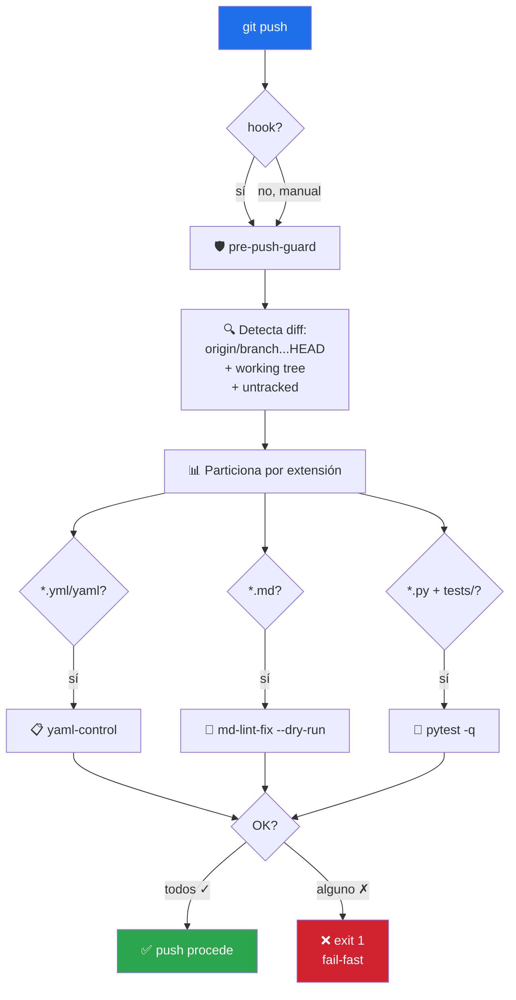
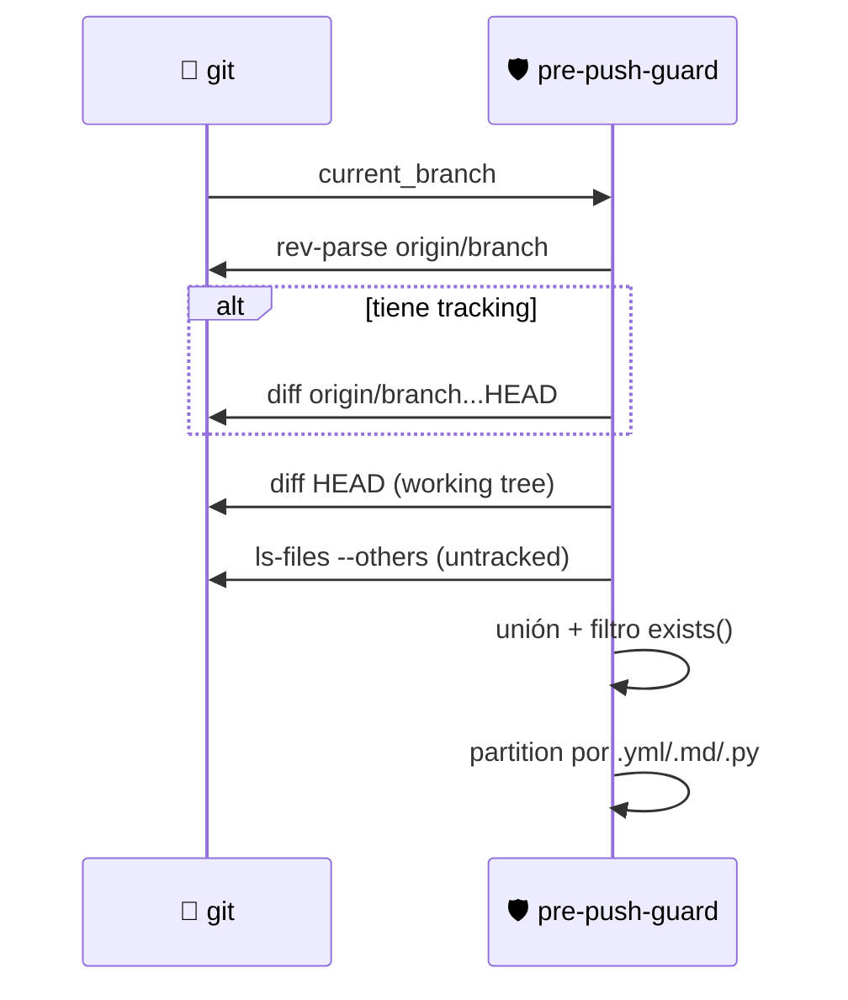

# 🛡️ pre-push-guard

> Orquestador pre-push: encadena `yaml-control` + `md-lint-fix --dry-run` + `pytest` sobre el diff vs `origin/<branch>`. Fail-fast con reporte unificado. Opcionalmente se instala como git hook.


---

## 🎯 Qué hace

Un **único comando** que ejecuta toda la suite de validación local del toolkit sobre los archivos modificados — para evitar que llegue a CI un push que ya se sabía roto.



Es un **orquestador**: no duplica lógica. Invoca [yaml-control](../yaml-control/README.md), [md-lint-fix](../md-lint-fix/README.md) y `pytest` en orden sobre el diff real, y agrega los resultados.

---

## 🚦 Cuándo se activa

**Triggers explícitos:**

- `"valida antes de pushear"` · `"chequea todo antes del push"` · `"pre-push"`
- `"guard antes de push"` · `"corre todos los checks"` · `"lint completo antes de subir"`

**Triggers proactivos:**

- Justo antes de `git push` con cambios sin pushear
- Después de que CI estuvo rojo por lint/tests

---

## 📦 Instalación

### Vía toolkit installer (recomendado)

```bash
git clone https://github.com/vladimiracunadev-create/claude-skills-toolkit.git ~/claude-skills-toolkit
cd ~/claude-skills-toolkit && ./scripts/install.sh
```

### Standalone

```bash
curl -L -o pre-push-guard.zip \
  https://github.com/vladimiracunadev-create/claude-skills-toolkit/releases/latest/download/pre-push-guard-v0.2.0.zip
unzip pre-push-guard.zip -d ~/.claude/skills/pre-push-guard/
```

### Como git hook (opt-in)

```bash
cd /tu/repo
python ~/.claude/skills/pre-push-guard/pre_push_guard.py --install-hook
```

Esto crea `.git/hooks/pre-push` (respalda hook previo como `.pre-push.bak`). El hook se salta con `git push --no-verify` en emergencia.

---

## 🚀 Uso

### Modo básico — validación pre-push

```bash
python ~/.claude/skills/pre-push-guard/pre_push_guard.py
```

### Opciones

| Flag | Qué hace |
|---|---|
| `--all` | Todos los archivos rastreados (no solo diff) |
| `--no-tests` | Salta pytest (solo lint) |
| `--no-lint` | Salta yaml-control y md-lint-fix (solo tests) |
| `--json` | Output JSON estructurado |
| `--install-hook` | Registra como git pre-push hook |
| `--uninstall-hook` | Desinstala el hook |

**Exit codes:** `0` OK · `1` algún check falló → bloquea push · `2` error de invocación.

---

## 💡 Casos de uso reales

### 1. Caso OK

```text
$ python ~/.claude/skills/pre-push-guard/pre_push_guard.py
pre-push-guard — repo: C:/dev/claude-skills-toolkit
  rama: main · base: origin/main
  diff: 4 archivos (.github/workflows/ci.yml, README.md, skills/foo/main.py, tests/test_foo.py)

[1/3] yaml-control · 1 archivo
  ✓ .github/workflows/ci.yml
  (0.8s)

[2/3] md-lint-fix --dry-run · 1 archivo
  ✓ README.md
  (0.3s)

[3/3] pytest · 8 tests
  ✓ 8 passed
  (1.2s)

✅ Todo verde. OK para `git push` (2.3s total).
```

### 2. Caso con falla (fail-fast)

```text
$ python ~/.claude/skills/pre-push-guard/pre_push_guard.py
pre-push-guard — repo: C:/dev/foo
  rama: feat/auth · base: origin/main
  diff: 3 archivos

[1/3] yaml-control · 1 archivo
  ✗ compose.yml — sintaxis YAML inválida (línea 14)
  (0.4s)

❌ Bloqueado en step [1/3]. Arregla y vuelve a intentar.
```

Exit `1`. Los pasos siguientes NO corren — fail-fast.

### 3. Instalado como hook

```bash
$ cd mi-repo && python ~/.claude/skills/pre-push-guard/pre_push_guard.py --install-hook
✓ Hook instalado en .git/hooks/pre-push
  Saltar con: git push --no-verify

$ git push
pre-push-guard — repo: mi-repo
[1/2] yaml-control · 0 archivos → ⊘ saltado
[2/2] pytest · 5 tests → ✓ 5 passed
✅ Todo verde. Pushing...
```

---

## 🧬 Cómo detecta el diff



La unión de tres fuentes garantiza cubrir todo lo que un push llevaría (commits locales + working tree + archivos nuevos aún sin add).

---

## 🧰 Dependencias

| Dependencia | Requerida | Notas |
|---|:-:|---|
| Python 3.11+ | ✅ | stdlib |
| `git` | ✅ | sistema |
| [yaml-control](../yaml-control/README.md) | opt | si falta, salta capa YAML con warning |
| [md-lint-fix](../md-lint-fix/README.md) | opt | si falta, salta capa MD con warning |
| `pytest` | opt | si hay `.py` en diff pero no está instalado, avisa y aborta |

Degradación silenciosa — nunca falla porque un skill hermano no esté instalado.

---

## ⚠️ Qué NO hace

- ❌ **No hace auto-fix.** Por diseño — bloquea, no modifica. Corre `md-lint-fix` por separado si quieres auto-fix.
- ❌ **No instala dependencias.** Si `pytest` no está y hay `.py`, avisa y aborta.
- ❌ **No reemplaza CI.** Es un *pre-flight check*.
- ❌ **No corre security-audit.** Audit es pesado y opt-in. Invócalo manualmente.
- ❌ **Los flags `--no-tests` / `--no-lint` no aplican al hook** — el hook siempre corre la suite completa.

---

## 🔗 Skills relacionados

- [🪝 pre-commit-guard](../pre-commit-guard/README.md) — gemelo rápido: corre en `git commit`, sin pytest
- [📋 yaml-control](../yaml-control/README.md) — la capa 1
- [📝 md-lint-fix](../md-lint-fix/README.md) — la capa 2 (modo dry-run)
- [🔒 security-audit](../security-audit/README.md) — NO incluido (demasiado pesado para pre-push)

### Recomendado: instalar ambos hooks

```bash
python ~/.claude/skills/pre-commit-guard/pre_commit_guard.py --install-hook
python ~/.claude/skills/pre-push-guard/pre_push_guard.py --install-hook
```

Dos capas progresivas — commit rápido / push completo.

---

## 📚 Referencias

- [Git hooks](https://git-scm.com/book/en/v2/Customizing-Git-Git-Hooks) — documentación oficial
- [`git push --no-verify`](https://git-scm.com/docs/git-push#Documentation/git-push.txt---no-verify) — escape hatch estándar
