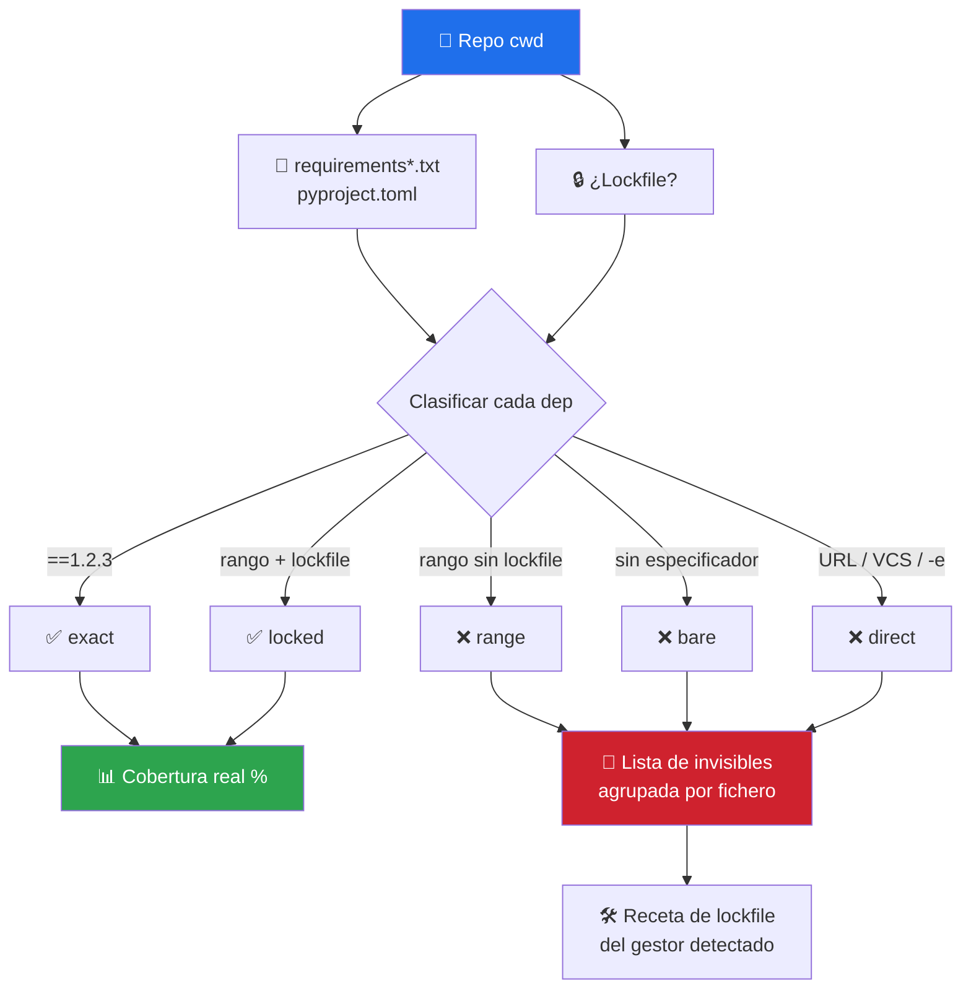

# 📌 python-deps-pinning

> Convierte el silencio de tu scanner de vulnerabilidades en un número. Mide qué porcentaje de tus dependencias Python es **realmente auditable** y nombra, una por una, las que quedan fuera.


---

## 🎯 Qué hace

Un scanner de vulnerabilidades responde a una pregunta concreta: *"¿la versión **2.31.0** de `requests` tiene CVEs?"*.

Si tu `requirements.txt` dice `requests` a secas, o `requests>=2.0`, **no hay versión que consultar**. Esa dependencia no sale limpia del scan — es que nunca entró en él.



### El problema en una línea

> Un reporte de seguridad que dice **"0 vulnerabilidades"** sobre una superficie que **nunca miró** es peor que no tener reporte: da confianza sin respaldo.

[`security-audit`](../security-audit/README.md) ya es honesto sobre esto — declara que las deps sin pin quedan fuera del scan. Lo que faltaba era **cuantificarlo**: cuántas son, cuáles, y en qué fichero.

---

## 📦 Instalación

Viene con el toolkit:

```bash
git clone https://github.com/vladimiracunadev-create/claude-skills-toolkit.git ~/claude-skills-toolkit
cd ~/claude-skills-toolkit && ./scripts/install.sh
```

Cero dependencias externas — solo Python 3.11+ (usa `tomllib` de la stdlib).

---

## 🚀 Uso

```bash
# Reporte completo
python ~/.claude/skills/python-deps-pinning/python_deps_pinning.py

# Falla si queda alguna dependencia invisible
python ~/.claude/skills/python-deps-pinning/python_deps_pinning.py --strict

# Falla si la cobertura baja de un umbral (útil en CI)
python ~/.claude/skills/python-deps-pinning/python_deps_pinning.py --threshold 90

# Para pipelines
python ~/.claude/skills/python-deps-pinning/python_deps_pinning.py --json
```

Conversacionalmente desde Claude Code:

```text
> por qué el scan de seguridad no encuentra nada
  → 📌 invoca python-deps-pinning · revela que la cobertura real es 0%

> pinea las dependencias de este repo
  → 📌 invoca python-deps-pinning · lista las invisibles + receta de lockfile
```

---

## 🧮 Cómo se calcula la cobertura

```text
cobertura = (deps con versión resoluble / deps declaradas) × 100
```

| Estado | Ejemplo | Cuenta como |
|---|---|---|
| `exact` | `requests==2.31.0` | ✅ auditable |
| `locked` | `requests>=2.0` + lockfile **en el mismo directorio** | ✅ auditable |
| `range` | `requests>=2.0` sin lockfile | ❌ invisible |
| `bare` | `requests` | ❌ invisible |
| `direct` | `pkg @ https://…`, `git+…`, `-e ./pkg` | ❌ invisible |

Dos decisiones deliberadamente conservadoras:

1. **`==1.2.*` no es un pin.** El comodín no fija una versión concreta, así que cuenta como rango.
2. **Un lockfile solo cubre su propio directorio.** Un `poetry.lock` en la raíz no se asume válido para el `requirements.txt` de un subproyecto. Prefiere subestimar la cobertura antes que inflarla — que es justo el error que este skill existe para evitar.

---

## 🔗 Relación con los otros skills

| Skill | Qué cubre | Diferencia |
|---|---|---|
| [`security-audit`](../security-audit/README.md) | Busca CVEs en las deps **auditables** | Este skill le dice **cuántas no lo son** |
| [`python-version-control`](../python-version-control/README.md) | Versión del **intérprete** Python | Este cubre la versión de las **dependencias** — no se solapan |
| [`python-lint-guard`](../python-lint-guard/README.md) | Estilo del código propio | Este mira el árbol de terceros |

Flujo natural:


---

## ⚠️ Límites explícitos

| Límite | Detalle |
|---|---|
| Solo lectura | No ejecuta `pip-compile` ni `poetry lock` — regenerar un lockfile cambia el árbol y es decisión del proyecto |
| Sin red | No resuelve versiones ni valida existencia en PyPI. Eso es trabajo de `security-audit` |
| No valida el lockfile | Comprueba presencia, no sincronía. Un lockfile obsoleto cuenta como cobertura |
| No cubre `setup.py` dinámico | `install_requires` computado en Python es código, no un manifest declarativo |
| Solo Python | Para el resto del árbol → `security-audit` |

---

## 📚 Referencias

- PEP 621 — metadatos de proyecto en `pyproject.toml`: <https://peps.python.org/pep-0621/>
- PEP 735 — dependency groups: <https://peps.python.org/pep-0735/>
- `pip-tools`: <https://github.com/jazzband/pip-tools>
- `uv`: <https://docs.astral.sh/uv/>
- OSV.dev — base de datos de vulnerabilidades: <https://osv.dev/>
