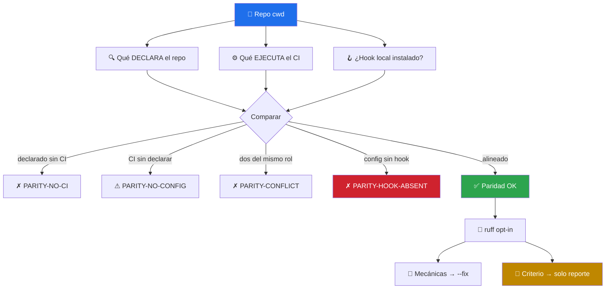
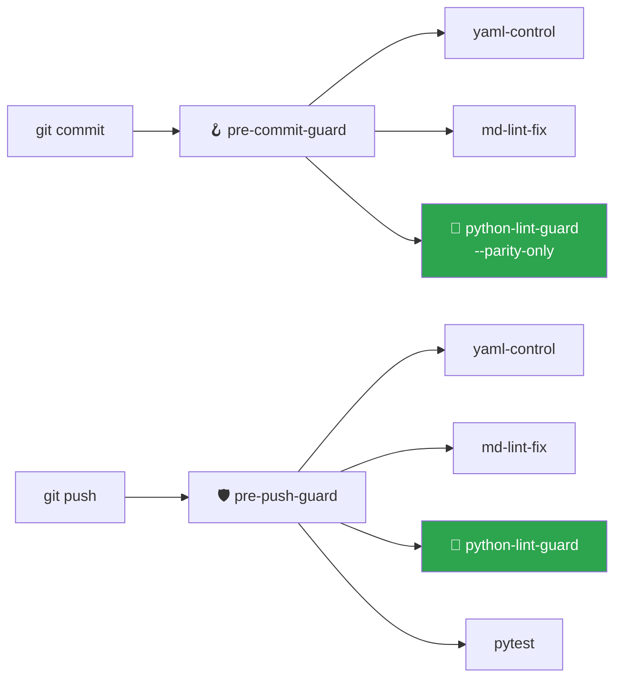

# 🐍 python-lint-guard

> El gate de lint Python que faltaba antes de commit/push. Su aporte no es correr `ruff` — es detectar la **deriva entre lo que el repo declara y lo que el CI ejecuta**, incluido el gate que existe en el papel pero no en tu máquina.


---

## 🎯 Qué hace

Resuelve un problema que se mide en commits desperdiciados:

> *"El CI se puso rojo por `ruff F401`. Commit de arreglo. Rojo otra vez por `I001`. Otro commit. Rojo por black. Otro más."*

Esos commits no aportan nada al producto — solo apagan un linter que debió correr antes. Y no ocurren porque falte el linter: ocurren porque **el linter no corre donde el desarrollador trabaja**.



### El hallazgo que justifica el skill

`PARITY-HOOK-ABSENT` es el chequeo que más devuelve. Un repo puede tener todo bien puesto —`.pre-commit-config.yaml` con black y flake8, workflow de CI que los ejecuta— y aun así acumular decenas de commits de arreglo, porque **nadie corrió `pre-commit install`**. La configuración existe; la barrera no. Cada violación viaja hasta CI, vuelve como fallo, y cuesta un commit.

Ningún linter detecta esto, porque no es un problema de código: es un problema de dónde está puesto el gate.

---

## 📦 Instalación

Viene con el toolkit:

```bash
git clone https://github.com/vladimiracunadev-create/claude-skills-toolkit.git ~/claude-skills-toolkit
cd ~/claude-skills-toolkit && ./scripts/install.sh
```

El núcleo funciona con Python 3.11+ y nada más. Para la capa de violaciones:

```bash
pip install ruff
```

Sin `ruff`, el skill **no falla**: reporta `RUFF-ABSENT` y entrega igual el análisis de paridad.

---

## 🚀 Uso

```bash
# Los .py del diff (uso normal antes de commit/push)
python ~/.claude/skills/python-lint-guard/python_lint_guard.py

# Todos los .py rastreados por git
python ~/.claude/skills/python-lint-guard/python_lint_guard.py --all

# Auto-corrige SOLO lo mecánico
python ~/.claude/skills/python-lint-guard/python_lint_guard.py --fix

# Solo la capa de paridad — rápida, sin invocar ruff
python ~/.claude/skills/python-lint-guard/python_lint_guard.py --parity-only

# Para pipelines
python ~/.claude/skills/python-lint-guard/python_lint_guard.py --json
```

Conversacionalmente desde Claude Code:

```text
> por qué falla el lint en CI si en local pasa
  → 🐍 invoca python-lint-guard · detecta que el hook no está instalado

> arregla los errores de ruff de este repo
  → 🐍 invoca python-lint-guard --fix · corrige lo mecánico, reporta lo demás
```

---

## 🧠 Las dos clases de violación

La distinción central del skill: **no toda violación se arregla igual**.

| | Mecánicas | Requieren criterio |
|---|---|---|
| **Ejemplos** | `I001`, `F401`, `UP006`, `UP035`, `W291`, `RUF100` | `F841`, `E741`, `E402`, `E501`, `S110`, `C901` |
| **Qué son** | Ruido de formato e imports | Señales que pueden apuntar a un bug o a una decisión de diseño |
| **`--fix`** | ✅ las corrige | ❌ nunca las toca |

El caso que explica la regla es `F841` (variable asignada y nunca usada). Un `--fix` global la borra. Pero muchas veces esa variable no es basura: es el resultado de una llamada que alguien olvidó comprobar. Borrarla elimina el síntoma y deja el bug.

Por eso `--fix` invoca `ruff check --select <set-mecánico> --fix`, nunca un `--fix` a secas.

---

## 🔗 Integración con los guards



En `pre-commit-guard` corre en modo `--parity-only` para mantener el commit por debajo de 2 s. En `pre-push-guard` corre completo. Si no está instalado, ambos lo saltan con `⊘` sin romper nada.

---

## ⚠️ Límites explícitos

| Límite | Detalle |
|---|---|
| No formatea | No invoca `black` ni `ruff format`. Señala el conflicto; elegir formateador es del proyecto |
| No instala nada | Si falta `ruff` o el hook, da el comando — no lo ejecuta |
| Detección textual en workflows | Un linter invocado vía `Makefile` o script propio puede no detectarse → posible falso negativo en `PARITY-NO-CI` |
| No juzga la config | Qué reglas activar es decisión del proyecto |
| Solo Python | YAML → [`yaml-control`](../yaml-control/README.md) · Markdown → [`md-lint-fix`](../md-lint-fix/README.md) |

---

## 📚 Referencias

- Reglas de ruff: <https://docs.astral.sh/ruff/rules/>
- `pre-commit`: <https://pre-commit.com/>
- Skills hermanos: [`md-lint-fix`](../md-lint-fix/README.md) · [`python-version-control`](../python-version-control/README.md) · [`python-deps-pinning`](../python-deps-pinning/README.md)
