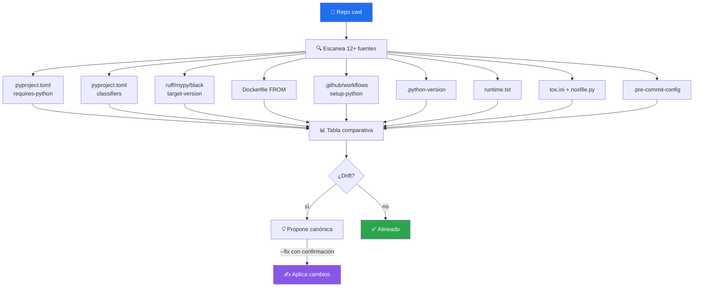

# 🐍 python-version-control

> Audita la coherencia de versión de Python entre **12+ fuentes de verdad** de un repositorio. Detecta drift y propone versión canónica. `--fix` es opt-in con confirmación explícita.


---

## 🎯 Qué hace

Resuelve el problema clásico:

> *"El CI corre 3.10, el Dockerfile usa 3.11, ruff apunta a `py310`, y la documentación dice 'Python 3.12+'."*

Drift así rompe en silencio: la clase enseña features de 3.12, el CI con 3.10 las rechaza, el contenedor de prod corre 3.11 con bugs específicos.



### Fuentes que revisa

| Fuente | Campo | Ejemplo |
|---|---|---|
| `pyproject.toml` | `[project] requires-python` | `">=3.10"` |
| `pyproject.toml` | `[project] classifiers` | `"Python :: 3.12"` |
| `pyproject.toml` | `[tool.ruff] target-version` | `"py310"` |
| `pyproject.toml` | `[tool.mypy] python_version` | `"3.12"` |
| `pyproject.toml` | `[tool.black] target-version` | `["py310"]` |
| `setup.py` / `setup.cfg` | `python_requires` | legacy |
| `Dockerfile*` | `FROM python:X.Y` | `python:3.11.10-slim` |
| `Dockerfile*` | `ARG PYTHON_VERSION` | `3.11` |
| `compose*.y*ml` | `image: python:X.Y` | derivado |
| `.github/workflows/*.yml` | `actions/setup-python` `with.python-version` | scalar o matrix |
| `.python-version` | contenido | `3.12.1` (pyenv) |
| `runtime.txt` | contenido | `python-3.11.10` (Heroku) |
| `tox.ini` | `envlist`, `[testenv:pyXY]` | `py310, py311` |
| `noxfile.py` | `@nox.session(python=...)` | lista |
| `.pre-commit-config.yaml` | `default_language_version` | `python3.12` |
| `README.md` | badges/texto | informativo |

---

## 🚦 Cuándo se activa

**Triggers explícitos:**

- `"audita versión python"` · `"coherencia python version"` · `"drift python"`
- `"qué versión python usa el repo"` · `"revisa python version"` · `"python version control"`

**Triggers proactivos:**

- Editaste `pyproject.toml`, `Dockerfile`, o workflows con `setup-python` en la sesión
- Antes de bumpear la versión de Python (para entender qué más tocar)
- Después de un CI fail por sintaxis solo presente en una versión del matrix

---

## 📦 Instalación

### Vía toolkit installer (recomendado)

```bash
git clone https://github.com/vladimiracunadev-create/claude-skills-toolkit.git ~/claude-skills-toolkit
cd ~/claude-skills-toolkit && ./scripts/install.sh
```

### Standalone

```bash
curl -L -o python-version-control.zip \
  https://github.com/vladimiracunadev-create/claude-skills-toolkit/releases/latest/download/python-version-control-v0.2.0.zip
unzip python-version-control.zip -d ~/.claude/skills/python-version-control/
```

Para Python < 3.11: `pip install tomli` (Python 3.11+ ya trae `tomllib` en stdlib).

---

## 🚀 Uso

### Modo básico — solo reporte

```bash
python ~/.claude/skills/python-version-control/scan.py
```

Escanea `Path.cwd()`, reporta drift entre fuentes. No modifica nada.

### Opciones

| Flag | Qué hace |
|---|---|
| `--fix <X.Y>` | Muestra el diff que aplicaría para alinear todo a `X.Y`. **No aplica sin confirmación explícita.** |
| `--json` | Salida estructurada para integrar con otros skills |

---

## 💡 Casos de uso reales

### 1. Drift detectado

```text
$ python ~/.claude/skills/python-version-control/scan.py

Fuente                                       Versión          Estado
─────────────────────────────────────────────────────────────────────
pyproject.toml  requires-python              >=3.10           ⚠ floor 3.10
pyproject.toml  ruff target-version          py310            ⚠ desfasado vs Docker
pyproject.toml  classifiers                  3.10, 3.11, 3.12 OK rango
Dockerfile      FROM                         3.11.10          ⚠ no es el target
.github/workflows/ci.yml matrix              3.10, 3.11, 3.12 OK
.github/workflows/deploy-pages.yml           3.12             OK (script run)
.github/workflows/security.yml               3.11             ⚠ inconsistente
.python-version                              (no existe)      —
README.md menciones                          3.12+            ⚠ pyproject permite 3.10

VERDICT: drift detectado (5 fuentes consistentes, 4 desalineadas)
Sugerencia: alinear a 3.12 (más reciente declarada como soportada
            en README/clases) o a 3.10 (mínima común). Revisa qué
            features usas para decidir.
```

### 2. Proponer diff a versión canónica

```bash
python ~/.claude/skills/python-version-control/scan.py --fix 3.12
```

Muestra qué cambiaría **sin escribir**. Aplica solo tras confirmación del usuario.

### 3. Integración con `pre-push-guard` (modo JSON)

```bash
python .../scan.py --json | jq '.drift'
```

Otros skills consumen el JSON para decidir si bloquear un push.

---

## 🧬 Reglas para el target

Cuando `--fix X.Y`:

- `requires-python` → `>=X.Y` (mantiene operador `>=`)
- `classifiers` → sincroniza al rango entre min de `requires-python` y max del CI matrix
- `target-version` de ruff/mypy/black → alinea al **mínimo** declarado (piso, no target ideal — evita features no disponibles en el min)
- `Dockerfile FROM` → usa **major.minor** del target principal (deja al runtime resolver el patch)
- Workflows `setup-python`:
  - **CI matrix** → rango del min al max declarado
  - **Deploy / Security** → una sola versión, la del target principal

---

## 🧰 Dependencias

| Dependencia | Requerida | Notas |
|---|:-:|---|
| Python 3.11+ | ✅ | usa `tomllib` de stdlib |
| `tomli` | opt | solo si Python < 3.11 |

**Cero binarios externos.** Todo Python stdlib.

---

## ⚠️ Cuándo NO usar

- ❌ Repos non-Python (sin `pyproject.toml`, `setup.py`, ni `requirements.txt`)
- ❌ Cuando el usuario está bumpeando una sola versión conscientemente
- ❌ Para dependencias específicas (eso lo cubre [security-audit](../security-audit/README.md))

**Importante:** cero auto-fix sin confirmación. El skill puede *proponer* el diff pero el usuario debe decir "aplica" antes de tocar archivos.

---

## 🔗 Skills relacionados

- [🔒 security-audit](../security-audit/README.md) — complementario: audit revisa CVEs de deps, este skill revisa la versión del *intérprete*
- [🛡️ pre-push-guard](../pre-push-guard/README.md) — puede invocar este skill en modo `--json` si el diff toca archivos relevantes
- [📋 yaml-control](../yaml-control/README.md) — ortogonal: yaml-control valida sintaxis de workflows, este skill detecta drift semántico

---

## 📚 Referencias

- [PEP 621](https://peps.python.org/pep-0621/) — `[project]` metadata en `pyproject.toml`
- [PEP 440](https://peps.python.org/pep-0440/) — Version specifiers
- [ruff target-version](https://docs.astral.sh/ruff/settings/#target-version)
- [mypy python_version](https://mypy.readthedocs.io/en/stable/config_file.html#confval-python_version)
