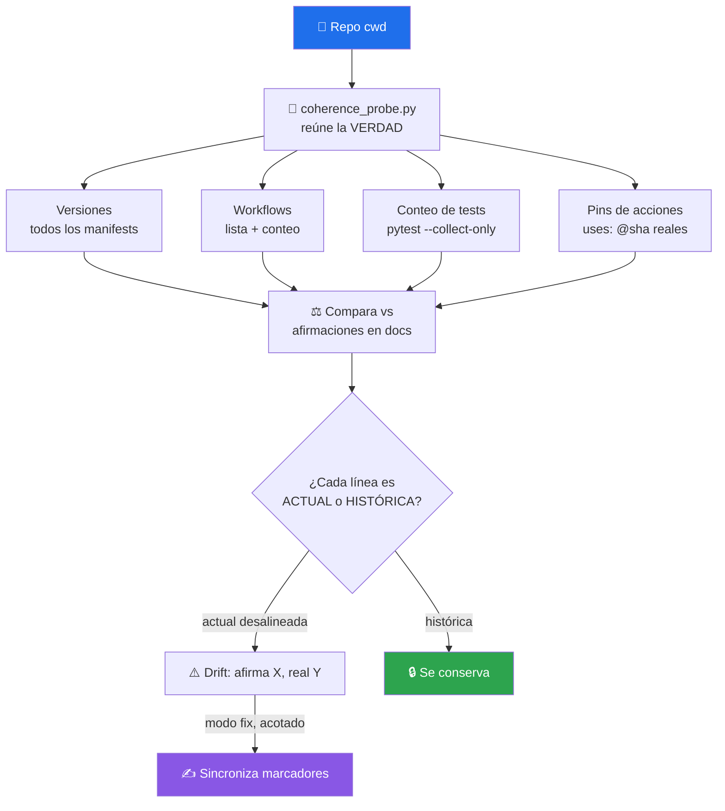

# 🧭 repo-coherence-audit

> Reconcilia lo que la **documentación afirma** contra las **fuentes de verdad verificables** del repo — versión, conteo de tests, workflows, pins de acciones a SHA, prerequisitos, encoding (mojibake) y metadatos del remoto (el "About" de GitHub). Detecta *drift* de estado y lo reporta con `fichero:línea`. Modo `fix` opt-in.


---

## 🎯 Qué hace

La documentación miente con el tiempo — no por mala fe, sino por deriva:

> *"Alguien añade 5 tests y el README sigue diciendo '49 tests'. Se bumpea `pyproject.toml` pero `package.json` y el endpoint `/status` se quedan atrás. Se migra a Node 24 pero la guía de instalación sigue pidiendo Node 20. Se pinnea una acción a un SHA nuevo pero la tabla del `SECURITY.md` muestra el viejo."*

Este skill **mide la verdad y la compara** con lo que los docs y el código afirman. No adivina: corre `pytest --collect-only`, lista `.github/workflows/`, lee los `uses:` reales, parsea cada manifest — y enfrenta esos hechos contra cada número/afirmación de "estado actual" que encuentra en la documentación.



### El Principio #1 — ACTUAL vs HISTÓRICO

El corazón del skill. Un `grep` de un valor viejo devuelve **dos cosas mezcladas** y clasificarlas mal es el fallo más dañino:

| | Ejemplo | Acción |
|---|---|---|
| **Marcador de estado ACTUAL** | título "— v0.10.1", `version` del manifest, `# 49 tests` junto a un comando `pytest`, tabla de "SHAs activos" | ✅ se **sincroniza** a la verdad |
| **Referencia HISTÓRICA** | "feature X añadida en v0.9.1", entradas de CHANGELOG, secciones de ROADMAP por versión, "22 → 49 tests" narrando una evolución | 🔒 **NO se toca** |

Regla mental: *¿esta línea afirma cómo está el repo AHORA, o narra qué pasó en una versión pasada?* Lo primero se corrige; lo segundo se preserva.

---

## 🔬 Dimensiones y su fuente de verdad

| Dimensión | Fuente de verdad | Marcadores ACTUALES típicos |
|---|---|---|
| **Versión** | manifest canónico del stack | título de docs, badge, `version` de otros manifests, endpoint `/status`, tags de imagen de ejemplo |
| **Conteo de tests** | `pytest --collect-only -q` · `vitest --run` · `go test -list` | "N tests" junto a comandos, tablas por-archivo, métricas |
| **Workflows** | `ls .github/workflows/*.y*ml` | "N workflows", enumeraciones |
| **Pins de acciones** | los `uses: …@<sha>` reales | tablas de "SHAs activos", ejemplos de pin |
| **Prerequisitos** | versión en CI (`setup-node`/`setup-python`) + `engines`/`requires-python` | "Node.js 20+", "Python 3.11+" |
| **Encoding (mojibake)** | `mojibake_probe.py` (round-trip sloppy-cp1252) | acentos y emoji degradados en docs/generadores: `más`, `🛡ï¸`, `·` |
| **Metadatos del remoto** | `gh api repos/<owner>/<repo>` | el "About" de GitHub: description, homepage, topics — invisible para todo `grep` local |

El script `coherence_probe.py` reúne versión + workflows + tests + pins **de una sola pasada**, degradando silenciosamente lo que no aplique al stack. El script `mojibake_probe.py` cubre la dimensión de encoding: detecta por **round-trip programático** (nunca por `grep` de patrones no-ASCII, que se corrompen en tránsito y matchean los bytes del texto *sano*), repara con el mapa *sloppy-cp1252* (cp1252 + latin-1 en los 5 bytes que cp1252 deja sin definir — sin él los emoji quedan rotos en silencio), y verifica con `residual = 0` releyendo del disco.

---

## 🚦 Cuándo se activa

**Triggers explícitos:**

- `"audita coherencia"` · `"revisa que los docs cuadren"` · `"hay incoherencias"`
- `"los conteos no cuadran"` · `"la versión está desincronizada"` · `"drift de versión/docs"`
- `"el README dice X pero el repo tiene Y"`
- `"caracteres raros"` · `"se ven mal los acentos o los emoji"` · `"encoding roto"` · `"más"`

**Triggers proactivos:**

- Después de editar manifests, workflows, o añadir/quitar tests
- Después de cambiar dependencias o prerequisitos de runtime
- Antes de publicar — para que los docs no salgan con números stale

---

## 📦 Instalación

### Vía toolkit installer (recomendado)

```bash
git clone https://github.com/vladimiracunadev-create/claude-skills-toolkit.git ~/claude-skills-toolkit
cd ~/claude-skills-toolkit && ./scripts/install.sh
```

### Standalone

```bash
curl -L -o repo-coherence-audit.zip \
  https://github.com/vladimiracunadev-create/claude-skills-toolkit/releases/latest/download/repo-coherence-audit-v0.2.0.zip
unzip repo-coherence-audit.zip -d ~/.claude/skills/repo-coherence-audit/
```

**Cero dependencias.** Solo Python 3.11+ stdlib (`tomllib` incluido). El conteo de tests usa `pytest` si está en el repo; si no, degrada.

---

## 🚀 Uso

### Reunir la verdad — el probe

```bash
python ~/.claude/skills/repo-coherence-audit/scripts/coherence_probe.py [ruta-repo]
```

Sin argumentos opera sobre `Path.cwd()`. Imprime versiones (todos los manifests), workflows (lista + conteo), conteo de tests y pins de acciones. **No modifica nada** — es la base contra la que el agente compara los docs.

### Auditar encoding — el mojibake probe

```bash
python ~/.claude/skills/repo-coherence-audit/scripts/mojibake_probe.py [ruta-repo]          # informe
python ~/.claude/skills/repo-coherence-audit/scripts/mojibake_probe.py [ruta-repo] --fix    # repara in situ
python ~/.claude/skills/repo-coherence-audit/scripts/mojibake_probe.py [ruta-repo] --show   # antes/después escapado a ASCII
```

Detecta texto degradado por decodificación errónea (UTF-8 leído como cp1252 y re-guardado): `más` → `más`, `🛡️` → `🛡ï¸`. Tras `--fix` re-corre el probe internamente y reporta `Residual tras reparar: 0` — si no es 0, sale con código 1.

### Los dos modos del skill

| Modo | Qué hace |
|---|---|
| **report** (por defecto) | Diagnostica: lista cada afirmación stale como `afirma X · real Y · fichero:línea`. No toca archivos. |
| **fix** (a petición) | Aplica correcciones **acotadas** por fichero/línea, regenera tablas derivadas desde la verdad, nunca un `sed` global. Solo marcadores ACTUALES; lo histórico se conserva. |

---

## 💡 Casos de uso reales

### 1. Salida del probe (este mismo toolkit)

```text
# coherence probe — /ruta/a/mi-proyecto

## Versiones declaradas (fuente de verdad = manifest canónico)
  (sin manifests de versión detectados)

## Workflows en .github/workflows/
  conteo real = 2
    - ci.yml
    - release.yml
  (recuerda: dependabot.yml NO es un workflow; jobs != workflows)

## Conteo de tests (fuente de verdad, no el README)
  .: 17 tests (pytest --collect-only)

## Acciones pinneadas a SHA (uses: reales)
  actions/checkout@11bd71901bbe5b1630ceea73d27597364c9af683  # v4.2.2
  actions/setup-node@49933ea5288caeca8642d1e84afbd3f7d6820020  # v4.4.0
  ...
```

### 2. El error sutil de las enumeraciones

Un conteo puede ser **correcto** y la **lista** estar mal. Caso real: "5 workflows" (número correcto) pero la enumeración listaba `dependabot` (que es config, no workflow) y omitía `workflow-security`. El skill verifica siempre la lista contra la fuente, no solo el número. Ojo con confundir *jobs de un workflow* con *workflows*, y *config* (`dependabot.yml`) con *workflows de Actions*.

### 3. Drift de versión multi-manifest

```text
!! DRIFT: conviven versiones distintas: 0.10.0, 0.10.1
  package.json          → 0.10.1   (canónico, coincide con el tag más reciente)
  frontend/package.json → 0.10.0   ⚠ marcador ACTUAL desalineado
  CHANGELOG "v0.10.0"   → 0.10.0   🔒 histórico, se conserva
```

---

## 🔀 Delegación: cuando el drift implica PUBLICAR

Este skill **reconcilia** versión como una afirmación más. Pero si la conclusión es *"hay que subir de versión y publicar un release"* (elegir semver, taggear, generar checksums, verificar artefactos), eso es una **acción deliberada** distinta:

- Solo **alinear** marcadores stale a la versión que YA es canónica → **este skill**.
- **Elegir** NEW > OLD y **publicar** (tag/release/artefactos) → el skill `version-bump` (uso local).

---

## 🧰 Dependencias

| Dependencia | Requerida | Notas |
|---|:-:|---|
| Python 3.11+ | ✅ | usa `tomllib` de stdlib |
| `pytest` | opt | solo para el conteo de tests; degrada si falta |
| `gh` (GitHub CLI) | opt | solo para la dimensión de metadatos del remoto (About de GitHub) |

**Cero binarios externos.** Todo Python stdlib.

---

## ⚠️ Cuándo NO usar

- ❌ Para **decidir y publicar** un release (usar un flujo de version-bump)
- ❌ Como reemplazo de un linter — no valida sintaxis, reconcilia afirmaciones
- ❌ Auto-fix ciego: el modo `fix` es acotado y opt-in; jamás reescribe historia

**Importante:** en modo fix, correcciones por ruta explícita y `git status` revisado antes de commitear. Nunca `git add -A` a ciegas.

---

## 🔗 Skills relacionados

- [🐍 python-version-control](../python-version-control/README.md) — ortogonal: ese audita la versión del *intérprete* Python (3.11 vs 3.12); este audita versión de *release* + conteos + workflows
- [🔒 security-audit](../security-audit/README.md) — complementario: audit mira CVEs de deps; este mira que los pins a SHA que los docs listan sean los reales
- [📋 yaml-control](../yaml-control/README.md) — yaml-control valida sintaxis de workflows; este verifica que el *conteo/enumeración* de workflows en los docs cuadre

---

## 📚 Referencias

- [Keep a Changelog](https://keepachangelog.com) — por qué las entradas históricas nunca se reescriben
- [SemVer](https://semver.org) — el modelo de versión que el skill reconcilia
- [pytest `--collect-only`](https://docs.pytest.org/en/stable/how-to/usage.html) — fuente de verdad del conteo de tests
