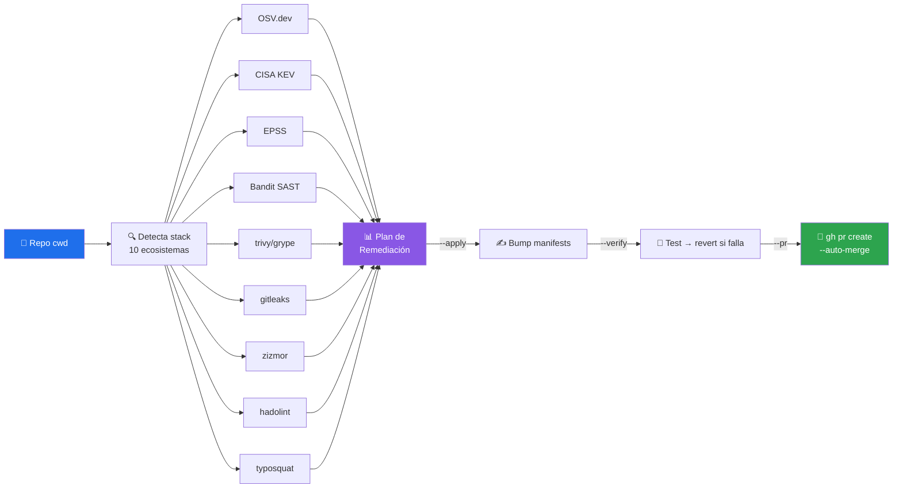
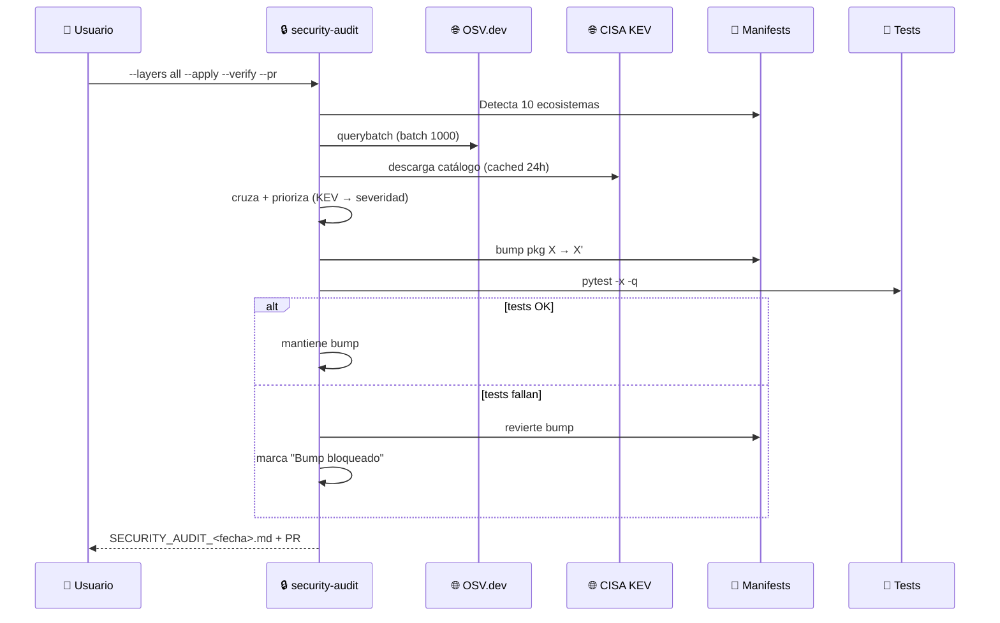

# 🔒 security-audit

> Auditoría de seguridad multi-fuente en **12 capas complementarias** — CVE scanning, SAST, secrets, container, workflows, typosquat. Cero deps por defecto, capas avanzadas opt-in con degradación silenciosa.


---

## 🎯 Qué hace

Escanea CUALQUIER repositorio contra 12 fuentes de verdad de seguridad, cruza CVEs con explotación activa (CISA KEV) y probabilidad de exploit (EPSS), y produce un **Plan de Remediación transversal** como un único checklist accionable. Opcionalmente aplica los fixes (`--apply`), los verifica corriendo tests (`--verify`) y publica un PR con auto-merge (`--pr`).

**Honestidad sobre cobertura:** el reporte declara explícitamente qué quedó **fuera del scan** — deps sin pin exacto (`flask>=2.0`), sin versión (`pandas`), o manifests sin lockfile — con archivo, línea y % de cobertura real. Un "0 vulnerabilidades" nunca se disfraza de cobertura completa.



### Las 12 capas

| # | Capa | Fuente | Cubre | Requisito |
|---|---|---|---|---|
| 1 | **osv** | OSV.dev | NVD + GHSA + PyPA + Go + RustSec + npm + Maven + RubyGems + NuGet | red |
| 2 | **kev** | CISA KEV | CVEs con explotación activa documentada | red, cache 24h |
| 3 | **epss** | FIRST.org | Probabilidad de exploit en 30 días | red |
| 4 | **recent** | OSV (filtro) | CVEs publicados en últimos N días | red |
| 5 | **news** | CISA RSS + `gh` | Vendor advisories + CVEs muy recientes | red + `gh` opcional |
| 6 | **pypi-malware** | Sonatype OSS Index | Paquetes retirados / maliciosos | `SONATYPE_OSSI_USER/TOKEN` |
| 7 | **sast** | Bandit | Vulns en TU código Python | `pip install bandit` |
| 8 | **container** | trivy / grype | OS layer del contenedor | `trivy` o `grype` |
| 9 | **secrets** | gitleaks / detect-secrets | Secretos en histórico git | `gitleaks` |
| 10 | **workflows** | zizmor | GitHub Actions: injection, permisos | `cargo install zizmor` |
| 11 | **dockerfile** | hadolint | Antipatterns Dockerfile | `hadolint` |
| 12 | **typosquat** | Levenshtein heur. | `requets` vs `requests` | stdlib |

---

## 🚦 Cuándo se activa

**Triggers explícitos:**

- `"audita la seguridad del repo"` · `"audita seguridad"`
- `"busca vulnerabilidades"` · `"scan CVE"` · `"vulnerability scan"`
- `"qué CVEs tiene este repo"` · `"actualiza por seguridad"`
- `"SAST"` · `"container scan"` · `"secrets scan"`
- `"revisa ataques de ciberseguridad"`

**Triggers proactivos:**

- El usuario menciona un CVE específico (`"CVE-2024-XXXX"`)
- Se cuestiona la seguridad de un paquete concreto (`"¿python-jose es seguro?"`)

---

## 📦 Instalación

### Vía instalador del toolkit (recomendado)

```bash
git clone https://github.com/vladimiracunadev-create/claude-skills-toolkit.git ~/claude-skills-toolkit
cd ~/claude-skills-toolkit && ./scripts/install.sh
```

El instalador crea el symlink `~/.claude/skills/security-audit/` → `<repo>/skills/security-audit/`.

### Standalone (skill individual)

Descarga solo este skill desde el [release](https://github.com/vladimiracunadev-create/claude-skills-toolkit/releases):

```bash
curl -L -o security-audit.zip \
  https://github.com/vladimiracunadev-create/claude-skills-toolkit/releases/latest/download/security-audit-v0.2.0.zip
unzip security-audit.zip -d ~/.claude/skills/security-audit/
```

### Capas opt-in (opcionales)

```bash
pip install bandit                   # capa sast
brew install trivy      # o: cargo install grype  → capa container
brew install gitleaks                # capa secrets
cargo install zizmor                 # capa workflows
brew install hadolint                # capa dockerfile
```

---

## 🚀 Uso

### Modo básico — solo reporte

```bash
python ~/.claude/skills/security-audit/security_audit.py
```

Corre las capas que no requieren binarios (`osv,kev,epss,typosquat`) y genera `SECURITY_AUDIT_<YYYY-MM-DD>.md` en la raíz del repo.

### Opciones

| Flag | Qué hace |
|---|---|
| `--layers all` | Corre TODAS las capas disponibles |
| `--layers osv,sast,container` | Selecciona capas específicas (csv) |
| `--ecosystem PyPI` | Filtra por ecosistema |
| `--min-severity high` | Solo hallazgos ≥ high |
| `--recent-days 30` | Ventana temporal para capa `recent` |
| `--out-dir docs/security/` | Directorio del reporte |
| `--apply` | Bumpea versiones a la mínima que arregla |
| `--verify` | Corre tests tras cada bump; revierte si fallan |
| `--git` | Rama + commit auto (`claude/security-audit-<fecha>`) |
| `--pr` | `gh pr create` + `gh pr merge --squash --auto` |

---

## 💡 Casos de uso reales

### 1. Auditoría pre-release

```bash
python ~/.claude/skills/security-audit/security_audit.py --layers all --apply --verify --git --pr
```

Escanea todo, bumpea lo bumpeable sin romper tests, publica PR con auto-merge. Bumps rechazados quedan documentados en el reporte bajo "Bumps bloqueados".

### 2. Verificar un CVE específico

Usuario: *"¿este repo está afectado por CVE-2024-XXXXX?"*

```bash
python ~/.claude/skills/security-audit/security_audit.py --min-severity low
grep -A5 "CVE-2024-XXXXX" SECURITY_AUDIT_*.md
```

### 3. Scan sin aplicar (auditoría manual)

```bash
python ~/.claude/skills/security-audit/security_audit.py --layers all --min-severity medium
```

Ejemplo de salida resumida:

```text
Security audit — repo: /ruta/a/mi-proyecto
  Detectados: 26 manifests PyPI, 0 npm
  ⚠ Cobertura: 4 dependencia(s) declaradas FUERA del scan (sin pin exacto o sin lockfile) — detalle en el reporte
  OSV.dev batch (26 grupos) → OK
  CISA KEV → 1342 CVEs vivos (cached)
Resultados:
  - 3 vulnerabilidades
    - 1 critical (CVE-2026-XXXXX en pkg-foo → fix 1.2.5) [CISA KEV ✓]
    - 2 high
Reporte: SECURITY_AUDIT_2026-05-19.md
```

Y en el reporte, la sección de cobertura hace el gap explícito:

```markdown
## 🔍 Cobertura del scan de dependencias

| Dependencia | Declarada como | Archivo | Motivo |
|---|---|---|---|
| `flask` | `flask>=2.0` | `requirements.txt:2` | sin pin exacto o formato no soportado |
| (12 deps) | — | `frontend/package.json` | sin package-lock.json — versiones no resueltas |
```

---

## 🧬 Cómo funciona por dentro



**Modo `--verify` — seguro contra rotura:** por cada bump aplicado, corre `pytest` (o `--test-cmd` custom). Si falla, revierte automáticamente y registra el bump en la sección "Bumps bloqueados" del reporte.

---

## 🧰 Dependencias

| Dependencia | Requerida | Motivo |
|---|:-:|---|
| Python 3.11+ | ✅ | stdlib para todo el core |
| red | ✅ | consulta OSV / KEV / EPSS |
| `bandit` | opt | capa SAST |
| `trivy` / `grype` | opt | capa container |
| `gitleaks` / `detect-secrets` | opt | capa secrets |
| `zizmor` | opt | capa workflows |
| `hadolint` | opt | capa dockerfile |
| `gh` CLI | opt | `--pr` + capa news |

Todas las opcionales **degradan con warning explícito**, no fallan.

---

## ⚠️ Limitaciones

- **Falsos positivos**: OSV.dev es agresivo. Sin `--apply` el revisor humano decide.
- **Solo audita versiones exactas resueltas** — pero el gap es **explícito, no silencioso**: la sección "🔍 Cobertura del scan" del reporte lista cada dep sin pin exacto o sin lockfile con archivo:línea, y el resumen ejecutivo muestra el % de cobertura real. Si NINGUNA dep es escaneable, sale con exit 1 y aviso en consola en vez de un engañoso "0 vulnerabilidades".
- **Deps transitivas**: si el manifest no las pinnea, no se auditan directamente — regenera el lockfile con la herramienta nativa.
- **Sin red**: falla con mensaje claro si OSV.dev no responde. CISA KEV se cachea 24h en `~/.cache/security-audit/cisa_kev.json`.
- **Bumps solo a "minimum fixed version"** — evita salto de major innecesario, pero no cierra CVEs que requieren refactor.
- **No "asegura" la seguridad** — ningún scanner puede. Detecta clases específicas de riesgo *conocido* (CVEs publicadas, secrets commiteados, antipatterns). 0-days, fallas de lógica de negocio y configuración insegura del despliegue quedan fuera de alcance por definición.

> 💡 **Repos sin dependencias:** las capas repo-level (`sast`, `secrets`, `workflows`, `dockerfile`, `container`) corren aunque el repo no declare ningún manifest — auditan el código y la configuración del repo en sí, no sus dependencias.

---

## 🔗 Skills relacionados

- [🐍 python-version-control](../python-version-control/README.md) — complementario: audita el intérprete, no las deps.
- [🐳 docker-compose-doctor](../docker-compose-doctor/README.md) — hallazgos operacionales del stack.
- [🛡️ pre-push-guard](../pre-push-guard/README.md) — bloquea push si hay CVEs críticas (integración manual).

---

## 📚 Referencias

- [OSV.dev](https://osv.dev/) — Open Source Vulnerabilities
- [CISA KEV](https://www.cisa.gov/known-exploited-vulnerabilities-catalog) — Known Exploited Vulnerabilities Catalog
- [EPSS](https://www.first.org/epss/) — Exploit Prediction Scoring System
- [Bandit](https://bandit.readthedocs.io/) · [trivy](https://trivy.dev/) · [zizmor](https://woodruffw.github.io/zizmor/) · [gitleaks](https://github.com/gitleaks/gitleaks)
