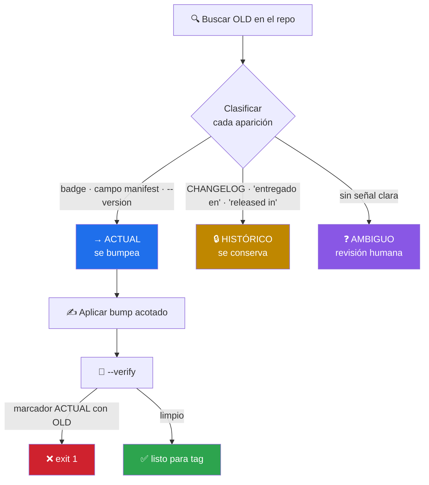
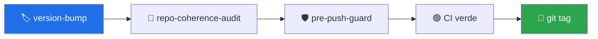

# 🏷️ version-bump

> Cambiar la versión de un producto de forma coherente en **todo** el repositorio — cualquier stack. Con `version_probe.py`, la regla crítica del proceso deja de ser criterio del agente y pasa a ser código verificable.


---

## 🎯 Qué hace

Un bump de versión parece un `sed`. No lo es. El `grep` de la versión vieja devuelve **dos cosas mezcladas** que exigen tratamiento opuesto:

```text
$ grep -rn "0.2.0" .

ROADMAP.md:6    []   ← ACTUAL: bumpear
CHANGELOG.md:47 ## 🎉 [0.2.0] — 2026-07-01                                    ← HISTÓRICO: conservar
```

Equivocarse en cualquiera de las dos direcciones tiene coste:

| Error | Consecuencia |
|---|---|
| Olvidar un marcador ACTUAL | La landing anuncia una versión que ya no es la última |
| Reescribir una entrada HISTÓRICA | Se rompe la trazabilidad del changelog, **de forma irreversible** |



### Por qué hacía falta el script

La versión anterior de este skill era **solo instrucciones**: 200 líneas explicándole al agente cómo distinguir actual de histórico. Funciona hasta que no funciona — y cuando falla, falla en silencio y de forma irreversible.

`version_probe.py` convierte esa regla en código con una propiedad importante: **no adivina**. Lo que no tiene señal concluyente sale marcado como `AMBIGUO` para revisión humana, en vez de arriesgar una clasificación mala.

---

## 📦 Instalación

Viene con el toolkit:

```bash
git clone https://github.com/vladimiracunadev-create/claude-skills-toolkit.git ~/claude-skills-toolkit
cd ~/claude-skills-toolkit && ./scripts/install.sh
```

Cero dependencias externas. `gh` es opcional y solo para el paso de release.

---

## 🚀 Uso

```bash
# Detecta la versión canónica de los manifests y clasifica sus apariciones
python ~/.claude/skills/version-bump/version_probe.py

# Clasifica una versión concreta
python ~/.claude/skills/version-bump/version_probe.py --old 0.2.0

# Prueba de fuego tras aplicar el bump — exit 1 si algo quedó a medias
python ~/.claude/skills/version-bump/version_probe.py --verify --old 0.2.0 --new 0.3.0

# Para pipelines
python ~/.claude/skills/version-bump/version_probe.py --old 0.2.0 --json
```

Conversacionalmente desde Claude Code:

```text
> sube la versión a 0.3.0
  → 🏷️ invoca version-bump · clasifica, bumpea lo actual, conserva la historia

> revisa si quedó algo con la versión vieja
  → 🏷️ invoca version_probe --verify · falla si algún badge quedó atrás
```

---

## 🧠 Cómo clasifica

Reglas en orden de precedencia:

| # | Regla | Resultado |
|---|---|---|
| 1 | Fichero `CHANGELOG` / `HISTORY` / `RELEASES` / `NEWS` | `HISTÓRICO` — salvo la sección `Unreleased`, que es `ACTUAL` |
| 2 | Campo de versión en un manifest (`package.json`, `Cargo.toml`, `pyproject.toml`, `*.csproj`, `pom.xml`, `VERSION`…) | `ACTUAL` |
| 3 | Señal **inequívoca** de presente: `shields.io`, `badge/`, `__version__`, `"version":`, `<Version>`, `--version` | `ACTUAL` |
| 4 | Señal de pasado: `entregado`, `released in`, `since v`, `added in`, `fixed in` | `HISTÓRICO` |
| 5 | Señal débil de presente: `versión actual`, `current version`, `en curso` | `ACTUAL` |
| 6 | Encabezado con versión | `ACTUAL` en `ROADMAP`/`PLAN`; `AMBIGUO` en el resto |
| 7 | Nada de lo anterior | `AMBIGUO` |

El orden importa. La regla 3 va **antes** que la 4 por un caso concreto que aparece en casi todos los repos:

```markdown
[](CHANGELOG.md)
```

Es un badge — estado actual — pero contiene la palabra `CHANGELOG` en la URL. Sin la precedencia correcta se clasificaría como historia y el badge se quedaría anclado a la versión vieja para siempre.

---

## 🔗 Relación con los otros skills

| Skill | Qué cubre |
|---|---|
| [`repo-coherence-audit`](../repo-coherence-audit/README.md) | El resto de afirmaciones de los docs: conteos de tests, workflows, pins, prerequisitos, encoding |
| [`python-version-control`](../python-version-control/README.md) | Versión del **intérprete** Python, no la del producto |

Flujo de release completo:



---

## ⚠️ Límites explícitos

| Límite | Detalle |
|---|---|
| El probe no modifica nada | Solo lectura: clasifica y verifica. Aplicar el bump es del agente, con reemplazos acotados |
| No adivina | Lo ambiguo se reporta como ambiguo — nunca se resuelve por estadística |
| No distingue badge real de badge citado | Una línea de docs que *muestra* la sintaxis de un badge se clasifica como `ACTUAL`: textualmente son idénticas. Da falsos positivos en documentación que explica el propio versionado |
| Sin binarios ni ficheros > 2 MB | Se saltan por diseño |
| No conoce versionados propios | Fechas o build numbers: busca la cadena que le pases, sin interpretarla |

---

## 📚 Referencias

- Semantic Versioning: <https://semver.org/lang/es/>
- Keep a Changelog: <https://keepachangelog.com/es-ES/1.1.0/>
- `gh release`: <https://cli.github.com/manual/gh_release>
