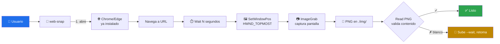

# 📸 web-snap

> Screenshots de URLs web en **Windows** usando Chrome/Edge ya instalado + `Pillow`. Sin Selenium, sin Playwright, sin ChromeDriver.


---

## 🎯 Qué hace

Filosofía: **"tengo Chrome abierto, quiero un PNG de esta URL ya"**. No pretende ser Playwright.



**Truco clave — `user32.SetWindowPos(HWND_TOPMOST)`**: antes de capturar, trae la ventana del browser al frente para minimizar la race condition con otras ventanas (Explorer, Claude Code, terminal).

---

## 🚦 Cuándo se activa

**Triggers explícitos:**

- `"captura pantalla"` · `"screenshot de esta URL"`
- `"snapshot de la consola AWS/Azure/GCP"` · `"documentar con capturas"`
- `"evidencia visual"` · `"generar PNGs de la web"`

**Triggers proactivos:**

- Necesitas dejar evidencia visual de un despliegue/demo
- Estás cerrando un GameDay o post-mortem que requiere screenshots reproducibles

## 🚫 Cuándo NO usarlo

- ❌ App es preview local en puerto → usa `mcp__Claude_Preview__preview_screenshot` (más limpio)
- ❌ Necesitas esperar selectores del DOM → usa Playwright/Selenium
- ❌ No estás en Windows → este skill depende de `user32.dll`

---

## 📦 Instalación

### Vía toolkit installer (recomendado)

```powershell
git clone https://github.com/vladimiracunadev-create/claude-skills-toolkit.git $env:USERPROFILE\claude-skills-toolkit
cd $env:USERPROFILE\claude-skills-toolkit
.\scripts\install.ps1
pip install pillow
```

### Standalone

```bash
curl -L -o web-snap.zip \
  https://github.com/vladimiracunadev-create/claude-skills-toolkit/releases/latest/download/web-snap-v0.2.0.zip
unzip web-snap.zip -d ~/.claude/skills/web-snap/
pip install pillow
```

Chrome o Edge ya deben estar instalados en el sistema.

---

## 🚀 Uso

### Modo single — 1 captura

```bash
python ~/.claude/skills/web-snap/web_snap.py archivo.png "https://console.aws.amazon.com/ecs" --wait 10 --out ./img
```

### Opciones

| Flag | Default | Qué hace |
|---|---|---|
| `<archivo.png>` | — | Nombre del PNG resultante |
| `<URL>` | — | URL completa entre comillas |
| `--wait N` | `6` | Segundos antes de capturar. Subir a 10-15 para consolas pesadas |
| `--out DIR` | `./img` | Directorio de salida (se crea si no existe) |
| `--browser` | `chrome` | `chrome` o `edge` |
| `--batch <file>` | — | Modo batch desde JSON |
| `--list` | — | Lista PNGs en `--out` con tamaño |

### Modo batch — N capturas en una pasada

`jobs.json`:

```json
[
  {"file": "01-cluster.png",      "url": "https://us-east-2.console.aws.amazon.com/ecs/v2/clusters", "wait": 10},
  {"file": "02-target-group.png", "url": "https://us-east-2.console.aws.amazon.com/ec2/#TargetGroups:", "wait": 8},
  {"file": "03-dashboard.png",    "url": "https://us-east-2.console.aws.amazon.com/cloudwatch/", "wait": 12}
]
```

```bash
python ~/.claude/skills/web-snap/web_snap.py --batch jobs.json --out ./caso-x/img
```

---

## 💡 Casos de uso reales

### 1. Documentar un GameDay Multi-AZ (origen del skill)

Nació en `caso-m-resiliencia-failover/scripts/snap.py` del repo `proyectos-aws-gitlab` para documentar un failover AZ con evidencia auditable en `VISUALIZATION.md`. Se promovió al toolkit al comprobar que aplicaba a cualquier despliegue.

### 2. Evidencia post-mortem

```bash
python .../web_snap.py incidente-2026-05.png "https://grafana.internal/d/latency" --wait 15
```

Captura el dashboard justo tras el incidente para adjuntar al post-mortem.

### 3. Verificación post-captura

```bash
python .../web_snap.py --list --out ./caso-x/img
```

Lista PNGs con tamaño en KB. **PNGs < 50 KB probablemente salieron en blanco** — re-tomar con `--wait` mayor.

Además, usa la herramienta `Read` sobre cada PNG para validar visualmente que capturó la URL correcta, no otra ventana.

---

## 🧬 Flujo recomendado al documentar un caso

1. **Verificar el método antes de empezar.** Toma 1 captura de prueba sobre una URL conocida y léela con `Read`. Si sale en blanco o captura la ventana incorrecta, ajusta antes de la sesión real.
2. **Hacer todas las capturas en batch.** Una vez levantado el stack/demo, `--batch jobs.json` con todas las URLs.
3. **Validar cada PNG con `Read`.** Re-tomar las que salieron mal.
4. **Referenciar en Markdown**: ``.

---

## 🧰 Dependencias

| Dependencia | Requerida | Instalar con |
|---|:-:|---|
| Python 3.11+ | ✅ | sistema |
| `pillow` | ✅ | `pip install pillow` |
| Chrome o Edge | ✅ | ya en Windows típicamente |
| Windows 10/11 | ✅ | requiere `user32.dll` |

---

## ⚠️ Limitaciones conocidas

| Limitación | Workaround |
|---|---|
| Captura TODA la pantalla (incluye barra de tareas) | Maximizar Chrome antes / cerrar otras ventanas |
| `--wait` es heurístico | Subir a 10-15s para consolas pesadas (AWS, Azure) |
| Race: a veces captura otra ventana | Usa `SetWindowPos(HWND_TOPMOST)` para minimizar; si falla, re-toma |
| Solo Windows interactivo | No funciona headless ni en SSH/RDP cerrado |
| No espera selectores del DOM | Usa Playwright si necesitas eso |

---

## 🔗 Skills relacionados

- Ninguno directo. `web-snap` es autocontenido y no compone con otros skills del toolkit.

---

## 📚 Referencias

- [Pillow `ImageGrab`](https://pillow.readthedocs.io/en/stable/reference/ImageGrab.html) — API de captura
- [`SetWindowPos` MSDN](https://learn.microsoft.com/en-us/windows/win32/api/winuser/nf-winuser-setwindowpos) — mecanismo topmost
- [Alternative: mcp__Claude_Preview__preview_screenshot](../../README.md) — mejor para preview local
