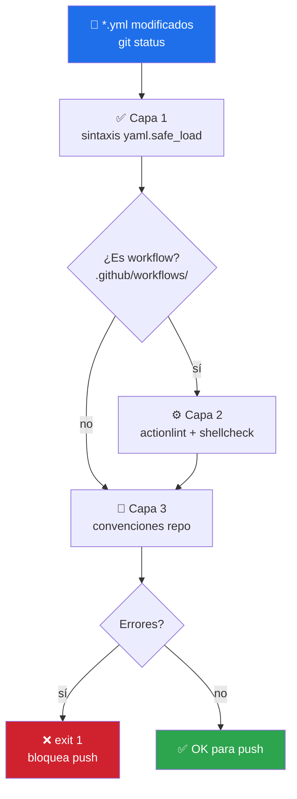

# 📋 yaml-control

> Validación YAML en **3 capas** — sintaxis + `actionlint` + convenciones del repo (SHA pinning, permisos, `fail-fast`). Bloquea el push si un workflow está roto.


---

## 🎯 Qué hace

Ejecuta tres capas de validación sobre archivos `.yml`/`.yaml`:



**Capa 1 — Sintaxis YAML:** parser + detección de BOM, tabs, indent inconsistente, anchors mal formados.

**Capa 2 — GitHub Actions schema:** `actionlint` verifica sintaxis de workflow + `shellcheck` embebido para los `run:` bash.

**Capa 3 — Convenciones del repo:**

- ✅ Actions pinneadas a SHA (`@11bd719...`) no a tag (`@v4`)
- ✅ `permissions:` explícito a nivel root
- ✅ `fail-fast: false` en matrices con > 5 elementos

---

## 🚦 Cuándo se activa

**Triggers explícitos:**

- `"valida los yaml"` · `"lint yaml"` · `"actionlint"`
- `"revisa los workflows"` · `"errores de github actions"`
- `"antes de pushear los workflows"`

**Triggers proactivos:**

- Editaste algo en `.github/workflows/`, `compose.yml` o `docker-compose.yml`
- Un PR está rojo con `Invalid workflow file` o `missing required property`

---

## 📦 Instalación

### Vía toolkit installer (recomendado)

```bash
git clone https://github.com/vladimiracunadev-create/claude-skills-toolkit.git ~/claude-skills-toolkit
cd ~/claude-skills-toolkit && ./scripts/install.sh
```

### Standalone

```bash
curl -L -o yaml-control.zip \
  https://github.com/vladimiracunadev-create/claude-skills-toolkit/releases/latest/download/yaml-control-v0.2.0.zip
unzip yaml-control.zip -d ~/.claude/skills/yaml-control/
pip install pyyaml
```

### `actionlint` (opt-in, para capa 2)

```bash
# Windows
winget install rhysd.actionlint

# Linux / macOS
bash <(curl -s https://raw.githubusercontent.com/rhysd/actionlint/main/scripts/download-actionlint.bash)
```

Si `actionlint` no está en PATH, el skill avisa: `⚠ actionlint no instalado — saltando validación de schema`.

---

## 🚀 Uso

### Modo básico — YAML modificados

```bash
python ~/.claude/skills/yaml-control/yaml_control.py
```

Valida solo los `.yml`/`.yaml` que aparezcan modificados según `git status`.

### Opciones

| Flag | Qué hace |
|---|---|
| `--all` | Todos los YAML del repo (no solo modificados) |
| `--workflows` | Solo `.github/workflows/` |
| `--dry-run` | Reporta sin instalar/modificar nada |
| `-v` | Verbose — muestra cada archivo verificado |

---

## 💡 Casos de uso reales

### 1. Pre-push con workflow editado

```bash
$ python ~/.claude/skills/yaml-control/yaml_control.py
YAML control — repo: C:/dev/langgraph-realworld
  scope: 3 archivos modificados

[1/3] .github/workflows/ci.yml
  ✓ sintaxis YAML
  ✓ actionlint
  ⚠ 2 actions sin SHA pinneado
    - actions/checkout@v4 (línea 16)
    - actions/setup-python@v5 (línea 19)

[2/3] .github/workflows/security.yml
  ✓ todas las capas

[3/3] cases/22-.../compose.yml
  ✓ sintaxis YAML
  - actionlint omitido (no es workflow)

Resumen: 2 warnings, 0 errores. OK para push.
```

### 2. Auditoría completa del repo

```bash
python ~/.claude/skills/yaml-control/yaml_control.py --all -v
```

Útil al onboarding en un repo nuevo o antes de un release.

### 3. Solo workflows

```bash
python ~/.claude/skills/yaml-control/yaml_control.py --workflows
```

Rápido: salta compose y otros YAML si solo te importa GitHub Actions.

---

## 🧬 Errores comunes detectados

| Patrón | Capa | Mensaje típico |
|---|:-:|---|
| Tabs en YAML | 1 | `found character '\t' that cannot start any token` |
| BOM al inicio | 1 | `mapping values are not allowed here` |
| `uses: actions/checkout@v4` | 3 | `action no pinneada a SHA` |
| `runs-on:` sin valor | 2 | `property "runs-on" is required` |
| Matriz N>5 sin `fail-fast: false` | 3 | `matrix sin fail-fast` |
| `${{ matrix.x }}` con `x` no declarada | 2 | `matrix value "x" is not defined` |
| `run: cd && cmd` sin `set -e` | 2 (shellcheck) | `SC2154`, `SC2086`, etc. |

---

## 🧰 Dependencias

| Dependencia | Requerida | Instalar con |
|---|:-:|---|
| Python 3.11+ | ✅ | sistema |
| `pyyaml` | ✅ | `pip install pyyaml` |
| `actionlint` | opt | `winget install rhysd.actionlint` |

---

## ⚠️ Limitaciones

- **No corrige, solo reporta.** Para auto-fix de YAML no hay soporte — el YAML es demasiado sensible al formato para tocarlo programáticamente.
- **Convenciones son opinadas** — si tu repo prefiere `@v4` sobre SHA, la capa 3 dará warnings que puedes ignorar (siguen siendo warnings, no errores).
- **No valida el schema de Compose** — para eso está [docker-compose-doctor](../docker-compose-doctor/README.md).

---

## 🔗 Skills relacionados

- [🩺 docker-compose-doctor](../docker-compose-doctor/README.md) — capa operacional del compose (yaml-control cubre la sintáctica)
- [🪝 pre-commit-guard](../pre-commit-guard/README.md) — invoca yaml-control sobre staged
- [🛡️ pre-push-guard](../pre-push-guard/README.md) — invoca yaml-control sobre el diff vs origin

---

## 📚 Referencias

- [actionlint](https://github.com/rhysd/actionlint) — GitHub Actions linter
- [shellcheck](https://www.shellcheck.net/) — embedded en actionlint
- [Pinning actions to SHA](https://docs.github.com/en/actions/security-guides/security-hardening-for-github-actions#using-third-party-actions) — recomendación oficial de GitHub
